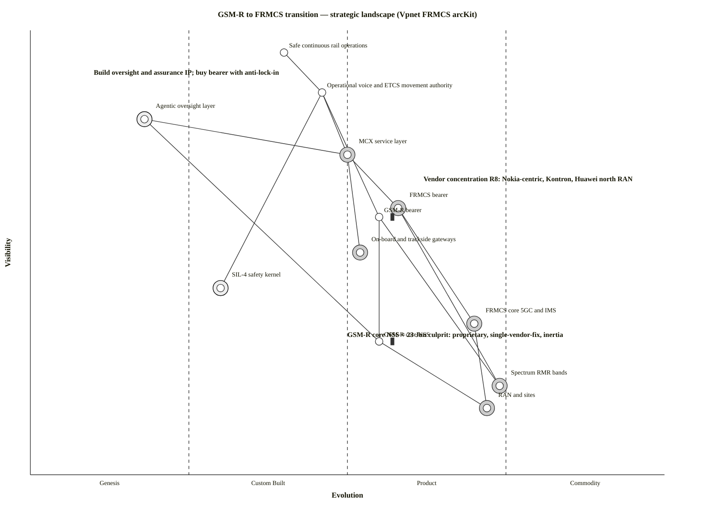

# Wardley Map — GSM-R → FRMCS transition (strategic landscape)

**Date:** 2026-06-30 · **Status:** Draft · **Owner:** Vpnet engagement lead · **Review:** 2026-07-30
**Command:** `/arckit:wardley` (adapted — saved in `current/` spine, not the plugin `projects/` scaffold)
**Strategic question:** Where do we *build* vs *buy* across the GSM-R→FRMCS transition, where is the vendor-lock-in/concentration risk (R8), and where does the proprietary-legacy inertia (the 23 Jun culprit) sit?
**Grounding (evidence):** requirements R1–R13; ADR-001 (transition), ADR-002 (oversight), ADR-004 (SIL-4 boundary), ADR-007 (testing), ADR-011 (change-control); risks PR11/PR12/PR15; evidence E-2026-06-27-01/-03 (outage cause), E-2026-06-27-05 (Nortel STP), E-2026-06-29-01 (5GRail lab), E-2026-06-29-02 (DB GSM-R supplier map), E-2026-06-24-04 (duopoly). Positions are analytical judgement grounded in these — not externally surveyed.

## Map (paste into https://create.wardleymaps.ai)

```wardley
title GSM-R to FRMCS transition — strategic landscape (Vpnet FRMCS arcKit)
anchor Safe continuous rail operations [0.95, 0.40]

component Safe continuous rail operations [0.95, 0.40]
component Operational voice and ETCS movement authority [0.86, 0.46]
component MCX service layer [0.72, 0.50]
component FRMCS bearer [0.60, 0.58]
component GSM-R bearer [0.58, 0.55] inertia
component On-board and trackside gateways [0.50, 0.52]
component FRMCS core 5GC and IMS [0.34, 0.70]
component GSM-R core NSS [0.30, 0.55] inertia
component Spectrum RMR bands [0.20, 0.74]
component RAN and sites [0.15, 0.72]
component Agentic oversight layer [0.80, 0.18]
component SIL-4 safety kernel [0.42, 0.30]

Safe continuous rail operations -> Operational voice and ETCS movement authority
Operational voice and ETCS movement authority -> MCX service layer
Operational voice and ETCS movement authority -> GSM-R bearer
Operational voice and ETCS movement authority -> SIL-4 safety kernel
MCX service layer -> FRMCS bearer
MCX service layer -> On-board and trackside gateways
FRMCS bearer -> FRMCS core 5GC and IMS
GSM-R bearer -> GSM-R core NSS
FRMCS bearer -> Spectrum RMR bands
GSM-R bearer -> Spectrum RMR bands
FRMCS core 5GC and IMS -> RAN and sites
GSM-R core NSS -> RAN and sites
Agentic oversight layer -> MCX service layer
Agentic oversight layer -> GSM-R core NSS

evolve GSM-R bearer 0.92 label Decommission by ~2035
evolve FRMCS bearer 0.80 label Commoditising 5G
evolve MCX service layer 0.70 label REC and interconnection maturing
evolve Agentic oversight layer 0.42 label Build differentiator

build Agentic oversight layer
build SIL-4 safety kernel
buy FRMCS bearer
buy MCX service layer
buy On-board and trackside gateways
buy FRMCS core 5GC and IMS
buy Spectrum RMR bands
buy RAN and sites

note GSM-R core NSS = 23 Jun culprit: proprietary, single-vendor-fix, inertia [0.31, 0.50]
note Vendor concentration R8: Nokia-centric, Kontron, Huawei north RAN [0.66, 0.62]
note Build oversight and assurance IP; buy bearer with anti-lock-in [0.90, 0.10]

style wardley
```

<details>
<summary>Mermaid Wardley Map</summary>



</details>

## Component inventory + strategic metrics

D = differentiation pressure = v·(1−e) (high → build) · K = commodity leverage = (1−v)·e (high → buy/commoditise)

| Component | v | e | Stage | D | K | Decision |
|---|---|---|---|---|---|---|
| Agentic oversight layer | 0.80 | 0.18 | Genesis | **0.66** | 0.15 | **BUILD** (differentiator) |
| Operational voice + ETCS MA | 0.86 | 0.46 | Custom | 0.46 | 0.06 | Assure/build (safety service) |
| MCX service layer | 0.72 | 0.50 | Custom/Product | 0.36 | 0.14 | BUY (prove parity — PR15) |
| SIL-4 safety kernel | 0.42 | 0.30 | Custom | 0.29 | 0.13 | **BUILD** (certified, non-actuating) |
| On-board/trackside gateways | 0.50 | 0.52 | Product | 0.24 | 0.26 | BUY (open OBapp = anti-lock-in) |
| FRMCS bearer | 0.60 | 0.58 | Product | 0.25 | 0.23 | BUY |
| GSM-R bearer | 0.58 | 0.55 | Product *(stuck)* | 0.26 | 0.23 | **DECOMMISSION** |
| GSM-R core NSS | 0.30 | 0.55 | Product *(stuck)* | 0.14 | 0.39 | **REPLACE** (should've commoditised) |
| FRMCS core 5GC/IMS | 0.34 | 0.70 | Product→Commodity | 0.10 | **0.46** | BUY/commoditise |
| Spectrum RMR | 0.20 | 0.74 | Commodity | 0.04 | **0.59** | Regulated allocation |
| RAN and sites | 0.15 | 0.72 | Commodity | 0.04 | **0.61** | BUY (reuse towers) |

**Validation:** highest-D component (oversight, 0.66) is the BUILD; highest-K components (RAN 0.61, spectrum 0.59, FRMCS core 0.46) are BUY/commodity. Consistent.

## The two stuck components (the core insight)

**GSM-R bearer and GSM-R core NSS are "stuck products" with inertia** — by age they *should* be commodity, but proprietary lock-in (Nortel→Kapsch→Kontron; E-2026-06-27-05, E-2026-06-29-02) and a single-vendor-fix dependency held them as an ageing product. That inertia is exactly what materialised on 23 June (silent fault in the core, no independent fix). This is the **"legacy trap" anti-pattern**, realised.

## Dependency-risk flags  R(a,b) = v(a)·(1−e(b))

| Dependency | R | Maps to |
|---|---|---|
| Operational voice → MCX service layer | **0.43** | PR15 (MCX feature-equivalence not yet mature) |
| Operational voice → GSM-R bearer | **0.39** | PR12 (visible safety service on stuck legacy during the bridge) |
| Agentic oversight → GSM-R core NSS | 0.36 | PR11/PR12 (oversight reads the legacy core; detection gap) |

## Climatic patterns
- **Everything evolves / inertia:** GSM-R should have commoditised; proprietary inertia kept it a stuck product → obsolescence and the outage.
- **Co-evolution:** commodity 5G (FRMCS core/spectrum) enables ATO/TMS digital-rail practices (R5).
- **Efficiency enables innovation:** commoditised bearer frees investment for the higher-order **agentic oversight layer** (the genesis build).
- **Concentration:** Nokia/Kontron duopoly + Huawei (R8) — supply structure, not just price.

## Applicable gameplay
- **Open-interfaces / open-standards play** (OBapp, MCX 3GPP, ORAN) → break lock-in on the bought components (R8); the "buy with anti-lock-in" lever.
- **Second-sourcing / unbundled tenders** (ADR-001, R8) → counter the duopoly + the Huawei single-region dependency.
- **Test-by-default doctrine** (ADR-007) + **CSM-RA significant-change discipline** (ADR-011, VO (EU) 402/2013) → defensive play against the change-on-legacy/silent-failover risk (PR11/PR12).
- **Build the higher-order system:** the agentic oversight/assurance layer is the genesis differentiator built *on top of* the commoditising bearer — don't build the bearer, build the thing that governs it.
- **Anti-pattern to avoid (already hit):** the legacy trap — proprietary GSM-R inertia.

## Recommendations
- **0–3 months:** ratify ADR-001 (Option B); make CSM-RA significance assessment binding on every change (ADR-011); stand up shadow-on-legacy oversight (ADR-007 surface b) on 2G now.
- **3–12 months:** prove MCX feature-equivalence (PR15) and silent-fault failover (ADR-007 surfaces c/e); drive open-interface + second-sourcing procurement (R8).
- **12–24 months:** canary-by-segment FRMCS rollout; GSM-R decommission per region; mature the agentic oversight layer (the build differentiator).

## Traceability
R1 (obsolescence — GSM-R inertia), R2 (coexistence/bridge), R3/R4 (SPOF/fail-soft — the stuck core), R5 (digital-rail), R6 (gateway decoupling), R7 (spectrum/standards), R8 (vendor concentration), R9–R12 (oversight layer). ADR-001/002/004/007/011. PR11/PR12/PR15. Evidence E-2026-06-27-01/-03/-05, E-2026-06-29-01/-02, E-2026-06-24-04.
