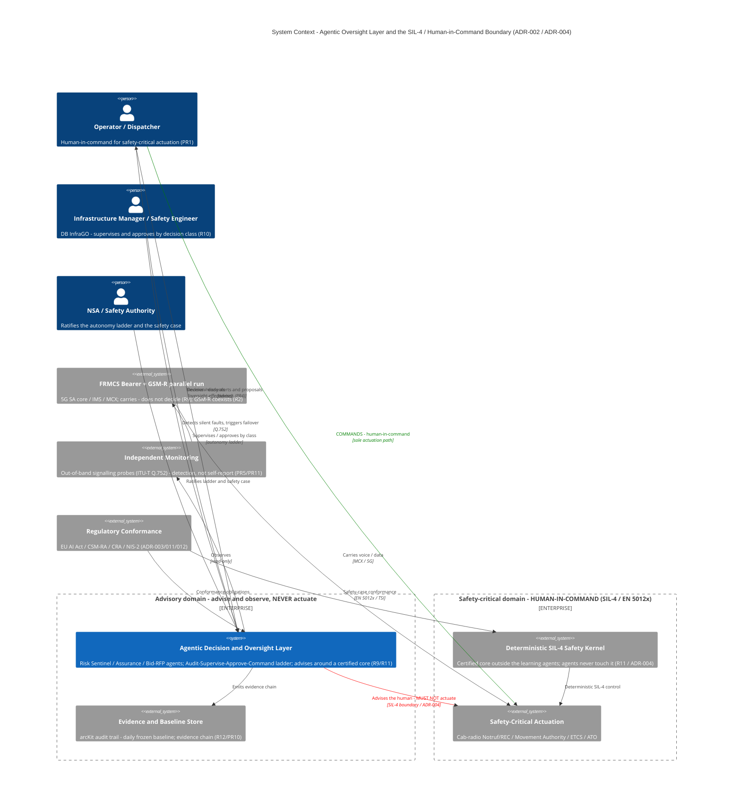

# C4 Context — Agentic Oversight Layer & the SIL-4 / Human-in-Command Boundary

**Date:** 2026-07-01
**Type:** C4 Context (Level 1) · Mermaid
**Scope:** The agentic decision & oversight layer (ADR-002) riding on the FRMCS bearer, with the SIL-4 / human-in-command boundary (ADR-004) made explicit.
**Linked records:** ADR-002 (oversight layer), ADR-004 (SIL-4 boundary), ADR-007 (test surfaces), ADR-011/012 (change-control & cyber conformance); traceability-matrix.md (R9–R12, R14); 03-risk-register.md (PR1/PR4/PR5/PR11).
**Owner:** Vpnet Cloud Solutions Sdn. Bhd.

> **Purpose.** Make the engagement's central guardrail legible in one picture: **the agents advise and observe; they never actuate. Safety-critical actuation stays human-in-command, and a deterministic SIL-4 kernel — not the learning agents — does the controlling.** This is *oversight, not control*.
>
> **Layout note (custom repo).** This engagement uses the `current/` + `baselines/` layout, not the arcKit plugin `projects/` scaffold, so the standard `ARC-…-DIAG-NNN` path/ID and the UK-Gov sections (TCoP / GOV.UK services / AI Playbook) are not applicable and are omitted. The artifact otherwise follows the `/arckit:diagram` structure.

## Diagram

**Legend for the two coloured edges — this is the whole point of the diagram:**

- 🟢 **Green** (`Operator → Safety-Critical Actuation`): the **only** sanctioned actuation path — a human commands safety-critical action.
- 🔴 **Red** (`Oversight Layer ⇢ Safety-Critical Actuation`): the **prohibited** path — the agents advise the human but **must not actuate**. This red line *is* the SIL-4 / EN 50129 freedom-from-interference boundary (ADR-004); the deterministic kernel, not the agents, controls.

## Component inventory

| Element | C4 type | Role | Evidence / ADR |
|---|---|---|---|
| Operator / Dispatcher | Person | Human-in-command; sole actuation authority | PR1 · R10 |
| Infrastructure Manager / Safety Engineer | Person | Supervises & approves agent actions by decision class | R10 · ADR-008 |
| NSA / Safety Authority | Person | Ratifies the autonomy ladder & safety case | R10 · ADR-002 |
| Agentic Decision & Oversight Layer | System (focus) | Risk Sentinel · Assurance · Bid/RFP; advises, never actuates | ADR-002 · R9/R11/R12 |
| Evidence & Baseline Store | System_Ext | arcKit audit trail; daily frozen baseline; evidence chain | R12 · PR10 |
| Deterministic SIL-4 Safety Kernel | System_Ext | Certified core; agents never touch it | R11 · ADR-004 |
| Safety-Critical Actuation | System_Ext | Notruf/REC · Movement Authority · ETCS/ATO | PR1 · PR15 |
| FRMCS Bearer + GSM-R parallel run | System_Ext | Carries, does not decide; coexistence | ADR-001 · R2/R9 |
| Independent Monitoring | System_Ext | Out-of-band Q.752 probes; detection ≠ self-report | PR5/PR11 · E-2026-06-30-03 |
| Regulatory Conformance | System_Ext | EU AI Act · CSM-RA · CRA/NIS-2 | ADR-003/011/012 · R14 |

**Element count: 10 / 10** (C4 Context threshold).

## Requirements & risk traceability

| Requirement / risk | How the diagram shows it |
|---|---|
| **R9** — autonomy as a layer over the bearer | Oversight layer is separate from the FRMCS bearer; "carries, does not decide" edge |
| **R10** — human oversight proportional to risk | IM/NSA supervise & ratify; Operator reviews/dissents (green command path) |
| **R11** — keep the safety case certifiable | Deterministic SIL-4 kernel sits *outside* the advisory domain; red no-actuation edge |
| **R12** — close the awareness gap | Oversight → decision-ready alerts; observes via independent monitoring; emits evidence chain |
| **R14** — cybersecurity regulatory conformance | Regulatory node → conformance obligations on both oversight & kernel |
| **PR1** — scope creep into autonomous actuation | The red prohibited edge + green human-in-command path are the mitigation, drawn |
| **PR4** — automation bias | Operator "reviews / dissents" edge (oversight-effectiveness) |
| **PR5/PR11** — silent-fault detection / failover | Independent monitoring (Q.752) detects & triggers failover, not element self-report |

## Diagram quality gate

| # | Criterion | Target | Result | Status |
|---|-----------|--------|--------|--------|
| 1 | Edge crossings | < 5 | ~2–3 (cross-boundary edges to `safetyAct`) | PASS (trade-off noted) |
| 2 | Visual hierarchy | Focus system prominent | Oversight layer is the only `System()`; boundaries frame it | PASS |
| 3 | Grouping | Related elements proximate | Two `Enterprise_Boundary` domains (advisory / safety-critical) | PASS |
| 4 | Flow direction | Consistent | Advise (top) → command/actuate (down); bearer/monitoring feed in | PASS |
| 5 | Relationship traceability | Each line followable | Coloured guardrail edges separated by offsets | PASS |
| 6 | Abstraction level | One C4 level | Context (Level 1) only | PASS |
| 7 | Edge-label readability | Legible, no overlap | Short labels; protocol in 2nd field; offsets on the two coloured edges | PASS |
| 8 | Node placement | No long edges | Connected nodes grouped; `c4BoundaryInRow=2` places domains side by side | PASS |
| 9 | Element count | ≤ 10 | 10 / 10 | PASS |

**Accepted trade-off (criterion 1):** two–three crossings are accepted where `Operator`, `Kernel`, and `Oversight` all connect to `Safety-Critical Actuation` — this convergence is *intentional*, since the contrast at that node (green human command vs red agent-prohibition vs deterministic kernel control) is the diagram's core message.

## How to view

Paste the Mermaid block into **GitHub markdown** (renders automatically), **https://mermaid.live**, or **VS Code** (Mermaid Preview extension). To match the repo's other diagrams, export to `current/project/diagrams/` as svg + png.

## Next steps

- Pairs with the Wardley map (`wardley-gsmr-frmcs-transition.md`) — strategic positioning vs this structural boundary.
- A **C4 Container** view could expand the oversight layer's internals (Risk Sentinel / Assurance / Bid-RFP + the autonomy-ladder rungs).
- A **Sequence** diagram of the silent-fault → Q.752-detection → failover cascade would make ADR-007 surface (c) concrete.

---

**Generated by:** `/arckit:diagram` (C4 Context · Mermaid), adapted to the `current/` layout
**Generated on:** 2026-07-01
**AI model:** claude-opus-4-8[1m]
**Generation context:** Built from traceability-matrix.md (R9–R14), ADR-002/004/007/011/012, and 03-risk-register.md (PR1/PR4/PR5/PR11).
