# Sequence — Silent-fault → failover cascade (23 June 2026) + the Q.752 counterfactual

**Date:** 2026-07-01
**Type:** Sequence · Mermaid
**Scope:** The DB-confirmed 23-June GSM-R outage cascade, and the counterfactual where **independent out-of-band monitoring (ITU-T Q.752)** triggers failover — the core of ADR-007 surface (c) and PR11.
**Linked records:** incident-annex.md; ADR-007 (test surfaces), ADR-011 (change-control); traceability-matrix.md (R3/R4/R12); 03-risk-register.md (PR5/PR11); evidence E-2026-06-27-01/-02/-03, E-2026-06-30-03.
**Owner:** Vpnet Cloud Solutions Sdn. Bhd.

> **Purpose.** Show *why the redundancy did not save the network*. The backup existed and was fully functional — the automatic failover watched the element's **self-reported health**, the fault was **silent**, so the trigger never fired. The fix is not "more redundancy" but a **trigger that does not depend on the component telling the truth about itself**.
>
> **Accessibility.** Dark background; **Okabe-Ito colourblind-safe palette** — the two bands are **amber (what happened, ✘)** and **blue (the fix, ✔)**, never red/green/brown. The ✘/✔ symbols and the band captions carry the meaning independently of colour, so the contrast reads under red-green colour-vision deficiency.

## Diagram

```mermaid
%%{init: {"theme":"dark","themeVariables":{"fontSize":"15px","darkMode":true}}}%%
sequenceDiagram
    autonumber
    actor Maint as Maintenance
    participant Core as Active Core
    participant NMS as NMS self-report
    participant Std as Standby redundancy
    participant Probe as Q.752 probe
    participant Ops as Dispatcher / Ops
    participant Net as Trains / Network

    rect rgb(74, 52, 12)
    Note over Maint,Net: ✘ 23 Jun 2026 - what actually happened (DB-confirmed, E-2026-06-27-03)
    Maint->>Core: Planned swap of network-distribution component
    Core-->>Core: Singular software fault - SILENT
    Note over Core,NMS: Fault raises no alarm and no error logging
    Core->>NMS: Reports health = OK (wrong)
    NMS--xStd: Auto-failover watches self-report - no fault seen - NOT triggered
    Note over Std: Redundancy fully functional - its trigger simply never fires
    Core->>Net: Voice and data path down, nationwide
    Net->>Ops: Trains stop - nationwide standstill (~22:30)
    Ops->>Core: Manual diagnosis and switchover (~90 min, ~00:30)
    Note over Maint,Net: Cyberattack ruled out
    end

    rect rgb(12, 48, 78)
    Note over Maint,Net: ✔ Counterfactual - independent out-of-band detection (ADR-007c / PR11 / E-2026-06-30-03)
    Maint->>Core: Same swap - same silent software fault
    Core->>NMS: Reports health = OK (still lies)
    Probe->>Core: Passive signalling watch - out-of-band (ITU-T Q.752)
    Note over Probe: Detects the signalling anomaly the element does NOT self-report
    Probe->>Std: Detection-driven failover trigger
    Std->>Net: Standby carries voice and data - service continuous
    Note over Ops,Net: No standstill - failover proven by the TRIGGER firing, not the backup existing
    end
```

**Legend — the two bands are the whole argument (colourblind-safe: symbol + caption, not colour alone):**

| Band | Colour | Marker | Meaning |
|---|---|---|---|
| Top | 🟠 amber | ✘ | What actually happened — the auto-failover trusts the element's self-report, sees "OK", and never triggers (step #5, the lost `--x` message). The redundancy was healthy the whole time |
| Bottom | 🔵 blue | ✔ | Same fault, but an **independent Q.752 probe** sees the signalling anomaly the element won't self-report, and drives the failover. Service stays continuous |

The decisive contrast is **step #5** (`--x` = the failover trigger that is lost) versus the blue band's `Probe → Std` detection-driven trigger.

## Participant inventory

| Lifeline | Role in the cascade | Evidence / ADR |
|---|---|---|
| Maintenance | Planned change — the swap that triggered the fault | E-2026-06-27-02/-03 · ADR-011 |
| Active Core | The network-distribution component that developed the silent software fault | incident-annex.md |
| NMS self-report | The element's self-reported health — the signal the auto-failover trusted, and which lied | PR11 |
| Standby redundancy | Fully functional backup whose trigger never fired | R3 · ADR-001 |
| Q.752 probe | Independent out-of-band signalling monitor — the engagement's fix | PR5/PR11 · E-2026-06-30-03 · ADR-007c |
| Dispatcher / Ops | Human who performed the ~90-min manual recovery | incident-annex.md |
| Trains / Network | The visible effect — nationwide standstill | E-2026-06-27-01 |

**Lifeline count: 7 / 8** (Sequence threshold).

## Requirements & risk traceability

| Requirement / risk | How the sequence shows it |
|---|---|
| **R3** — eliminate central SPOF | The single silent fault takes the whole network down; standby exists but is not enough on its own |
| **R4** — fail-soft; no full standstill on core loss | The standstill (amber) vs continuous service (blue) is exactly the R4 gap and its remedy |
| **R12** — close the awareness gap | "No alarm / no error logging" (steps #3–4) is the awareness gap; the probe closes it |
| **PR11** — redundancy defeated by a silent fault | The `--x` non-trigger (step #5) is PR11 drawn literally |
| **PR5** — telemetry insufficient to detect the SPOF signature | The blue band's out-of-band probe is the PR5 mitigation |
| **ADR-007 (c)** — silent-fault / failover injection | This cascade is the test to reproduce; the blue path is the pass criterion |
| **ADR-011** — change-control | The trigger was a *planned change* on a live element — the ADR-011 hazard |

## Diagram quality gate

| # | Criterion | Target | Result | Status |
|---|-----------|--------|--------|--------|
| 1 | Edge crossings | n/a for sequence | Linear top-to-bottom | PASS |
| 2 | Visual hierarchy | Key moment prominent | `--x` non-trigger + amber/blue bands carry the eye | PASS |
| 3 | Grouping | Related steps grouped | Two `rect` bands: actual vs counterfactual | PASS |
| 4 | Flow direction | Consistent | Top-to-bottom time axis | PASS |
| 5 | Traceability | Each message followable | 7 lifelines, `autonumber` | PASS |
| 6 | Abstraction level | One scenario | One incident + its counterfactual | PASS |
| 7 | Message readability | Legible | Short messages; detail in `Note over` | PASS |
| 8 | Placement | No long hops | Lifelines ordered by locality | PASS |
| 9 | Lifeline count | ≤ 8 | 7 / 8 | PASS |
| 10 | **Colour accessibility** | **Distinguishable under red-green CVD** | **Amber/blue bands + ✘/✔ + captions; dark bg** | **PASS** |

**Accepted trade-off:** the counterfactual sits in the *same* diagram (second band) — the side-by-side contrast is the point; separating them would lose the argument. Lifeline count stays within threshold.

## How to view

Paste the Mermaid block into **GitHub markdown**, **https://mermaid.live**, or **VS Code** (Mermaid Preview). Export to `current/project/diagrams/` as svg + png to sit with the other rendered diagrams.

## Companion diagrams

- `oversight-sil4-boundary-context.md` — the Context (who-may-actuate boundary), same accessible palette.
- `wardley-gsmr-frmcs-transition.md` — strategic positioning.

---

**Generated by:** `/arckit:diagram` (Sequence · Mermaid), adapted to the `current/` layout
**Generated on:** 2026-07-01 (restyled for dark-mode + colourblind accessibility)
**AI model:** claude-opus-4-8[1m]
**Generation context:** Built from incident-annex.md, ADR-007/011, traceability-matrix.md (R3/R4/R12), 03-risk-register.md (PR5/PR11), and evidence E-2026-06-27-01/-02/-03 + E-2026-06-30-03.
