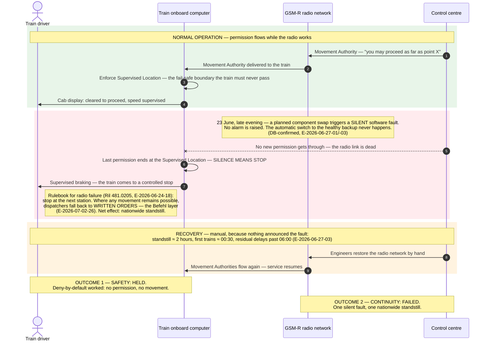

# Architecture Diagram: Why no train was in danger on 23 June

> **Template Origin**: Official | **ArcKit Version**: 5.11.0 | **Command**: `/arckit:diagram`
> **Layout note**: this repo uses the arcKit *method* on a custom layout (`current/` + `baselines/`), so this artefact lives in `current/project/diagrams/` rather than `projects/NNN/diagrams/`.

## Document Control

| Field | Value |
|---|---|
| Document ID | ARC-FRMCS-DIAG-001-v1.0 |
| Document Type | Architecture Diagram (Sequence) |
| Project | FRMCS arcKit — GSM-R→FRMCS transition + agentic oversight |
| Classification | PUBLIC (repo is public; all content paraphrased from logged evidence) |
| Status | DRAFT |
| Version | 1.0 |
| Created Date | 2026-07-02 |
| Last Modified | 2026-07-02 |
| Review Cycle | On evidence change (E-rows cited below) |
| Next Review Date | 2026-08-01 |
| Owner | Vpnet engagement lead (Vpnet Cloud Solutions Sdn. Bhd.) |
| Reviewed By | PENDING |
| Approved By | PENDING |
| Distribution | Engagement records; article/letter drafting inputs (pivot thread 0) |

## Revision History

| Version | Date | Author | Changes | Approved By | Approval Date |
|---------|------|--------|---------|-------------|---------------|
| 1.0 | 2026-07-02 | ArcKit AI | Initial creation from `/arckit:diagram` command (pivot thread 0 visual) | PENDING | PENDING |

---

## Purpose (layman audience)

The opening visual for pivot thread 0 (`../pivot-notes-2026-07-02.md`): on 23 June 2026 the nationwide loss of the GSM-R train radio caused a **standstill, not a collision**. Rail's safety design converts silence into stop — a train that receives no permission does not move. **Safety held; continuity failed.** This diagram is written for intelligent laypeople: every technical term is expanded on the canvas or in the legend.

## Diagram

**View this diagram**:

- **GitHub**: renders automatically in markdown preview (and in the frozen baseline)
- **VS Code**: Mermaid Preview extension
- **Online**: https://mermaid.live (paste code above)
- **Export**: mermaid.live → PNG/SVG for print/letters

**Caption (for reuse in drafts):** *"The system is designed so that silence means stop. On 23 June, 'safe' held and 'continuous' failed."*

---

## Legend / key

| Term on canvas | Layman meaning |
|---|---|
| Movement Authority (MA) | The digital permission slip: "you may proceed as far as point X" — issued by the control centre, carried over the radio |
| Supervised Location (SvL) | The fail-safe boundary the onboard computer enforces braking against — always at or beyond the authorised limit, never short of safety (E-2026-07-02-33 vocabulary; normative source: ETCS Subset-026) |
| Silent fault | A failure that raises no alarm — so monitoring stays green and automatic protections are never told to act |
| Befehl (written order) | Rail's standardised human fallback: a dispatcher's written instruction replacing the technical permission when systems can't issue one (E-2026-07-02-26) |
| Deny-by-default | The design stance: absence of permission means stop — the system never assumes safety it cannot confirm |

## Component inventory

| Component | Type | Role in this scenario | Evolution stage | Notes |
|-----------|------|----------------------|-----------------|-------|
| Train driver (Tf) | Human actor | Receives supervised braking; applies radio-failure rulebook | — | Safe default validated in-domain: under uncertainty, non-action degrades to a supervised stop (E-2026-07-02-24) |
| Train onboard computer (OBU/EVC) | Vital system (SIL 4) | Enforces the Supervised Location; brakes the train when permission ends | Product (certified) | The deny-by-default enforcement point — the layer ADR-004 keeps untouched |
| GSM-R radio network | Bearer (commodity, obsolescing ~2030) | Carries Movement Authorities, voice and emergency calls; the failed element on 23 June | Commodity | Single silent fault defeated the (existing, functional) redundancy — see ARC diagram 2 candidate (thread 1) |
| Control centre (dispatcher/RBC) | Vital + operational | Issues Movement Authorities; falls back to written orders; drove manual recovery | Product | RBC = Radio Block Centre on ETCS L2 lines; dispatcher (Fdl) on conventional lines |

## Key statements the diagram makes (and their evidence)

1. **The safety architecture converts communication loss into standstill by design.** No new MA → onboard enforces SvL → controlled stop. (E-2026-07-02-33 vocabulary; incident outcome per E-2026-06-27-01/-03.)
2. **The fault was silent — that is why recovery was manual and slow.** No alarm → no automatic failover despite a functional backup → ~2 h standstill, first trains ≈00:30. (DB-confirmed, E-2026-06-27-01/-02/-03; incident-annex.md.)
3. **The human fallback layer is what operations degrade onto.** Radio-failure rules (Ril 481.0205: stop at next station; fallback network cannot carry emergency/group calls) + the Befehl written-order layer. (E-2026-06-24-18, E-2026-07-02-26.)
4. **Two outcomes, named separately:** SAFETY = held (deny-by-default), CONTINUITY = failed (nationwide standstill). This is the gap between fail-*safe* (proven on 23 June) and fail-*soft* (R4 — open).

## Honesty constraints (binding on any reuse)

- Phrase the claim as **"loss of communication degraded to safe standstill by design"** — NOT "ETCS L2 saved the day". GSM-R serves voice/emergency-call and ETCS bearer duties; on conventional (non-ETCS-L2) lines the stop was driven by the radio-failure rulebook, not by MA enforcement. The diagram's MA/SvL lane is the ETCS-L2 mechanism; the note carries the rulebook mechanism.
- Standstill duration is **~2 hours** (first trains ≈00:30, residual delays past 06:00) per the incident annex — do not use the shorter "~90 minutes" figure in public drafts.
- The MA/SvL vocabulary currently traces to a D-tier explainer (E-2026-07-02-33). **Before print: log ETCS Subset-026 as A-tier** (flagged in pivot-notes thread 0).

## Requirements traceability

| Requirement | Description | Shown as | Coverage |
|-------------|-------------|----------|----------|
| R3 | Eliminate the central single point of failure | The single silent fault taking the nationwide bearer down (red panel) | ✅ context |
| R4 | Fail-soft; no full standstill on core loss | The named gap: safety held but the network could only STOP — fail-safe ≠ fail-soft | ✅ core message |
| R12 | Close the awareness gap | "No alarm is raised" — the silent-fault mechanism the oversight layer exists to detect | ✅ context |
| R11/ADR-004 | Certified vital kernel untouched by agents | The OBU's deny-by-default enforcement is the proven layer the boundary protects | ✅ context |

**Evidence refs:** E-2026-06-27-01/-02/-03 (confirmed cause + countermeasures) · E-2026-06-24-18 (Ril 481.0205 fallback rules) · E-2026-07-02-26 (Befehl layer) · E-2026-07-02-33 (MA/SvL vocabulary, D-tier — Subset-026 upgrade pending) · E-2026-07-02-24 (safe-default behaviour) · incident-annex.md.

## Quality gate (Step 5d)

| # | Criterion | Target | Result | Status |
|---|-----------|--------|--------|--------|
| 1 | Edge crossings | 0 (simple diagram) | 0 — sequence lifelines, no crossing message pairs | PASS |
| 2 | Visual hierarchy | Failure phase visually dominant | Three tinted phase panels (green/red/amber); red panel carries the pivotal note | PASS |
| 3 | Grouping | Related steps proximate | Phases grouped by `rect` blocks: normal / failure / recovery | PASS |
| 4 | Flow direction | Consistent | Top-to-bottom (inherent to sequence); actors ordered Driver→Onboard→Radio→Centre | PASS |
| 5 | Relationship traceability | Unambiguous | 4 lifelines, 10 messages, autonumbered | PASS |
| 6 | Abstraction level | One level | Operational scenario level throughout; no mixed C4 levels | PASS |
| 7 | Edge label readability | Legible, non-overlapping | Long text moved into Notes; message labels ≤ 1 line | PASS |
| 8 | Node placement | Connected nodes proximate | OBU adjacent to both Tf and NET (its two conversation partners) | PASS |
| 9 | Element count | ≤ 8 lifelines | 4/8 | PASS |

## Sections not applicable

Data flow/PII, security zones, cloud deployment, NFR tables, UK Government TCoP/GOV.UK, Wardley integration — N/A for this narrative sequence diagram (the Wardley view of the same story is the thread-5 visual, `pivot-prompts-2026-07-02.md`).

## Linked artifacts

**Narrative source**: `current/project/pivot-notes-2026-07-02.md` (thread 0)
**Prompt source**: `current/project/pivot-prompts-2026-07-02.md` (thread 0 block)
**Incident record**: `current/incident-annex.md`
**Evidence log**: `current/evidence-log.md` (E-ids cited above)
**Traceability**: `current/traceability-matrix.md` (R3, R4, R11, R12)
**Related diagrams**: `current/project/silent-fault-failover-cascade-sequence.md` (thread-1 companion, to be refreshed)

---

**Generated by**: ArcKit `/arckit:diagram` command
**Generated on**: 2026-07-02
**ArcKit Version**: 5.11.0
**Project**: FRMCS arcKit (custom layout)
**AI Model**: claude-fable-5
**Generation Context**: incident-annex.md + evidence-log rows E-2026-06-27-01/-02/-03, E-2026-06-24-18, E-2026-07-02-24/-26/-33; pivot thread 0
