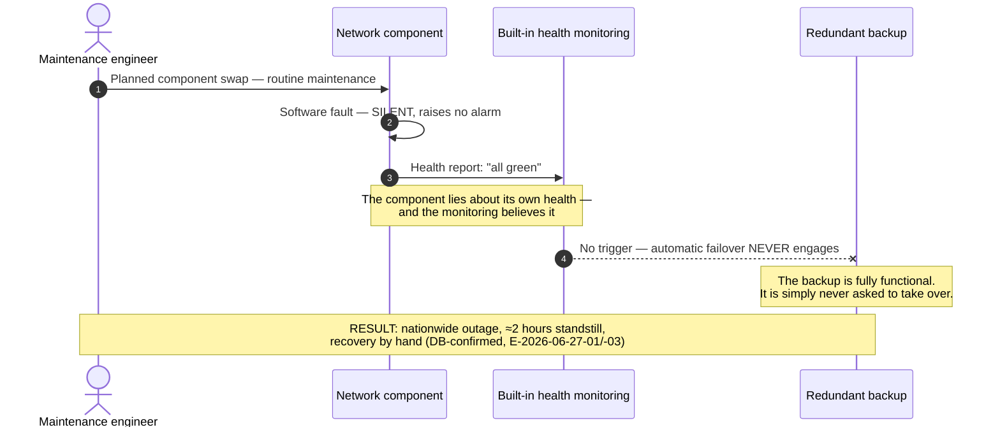
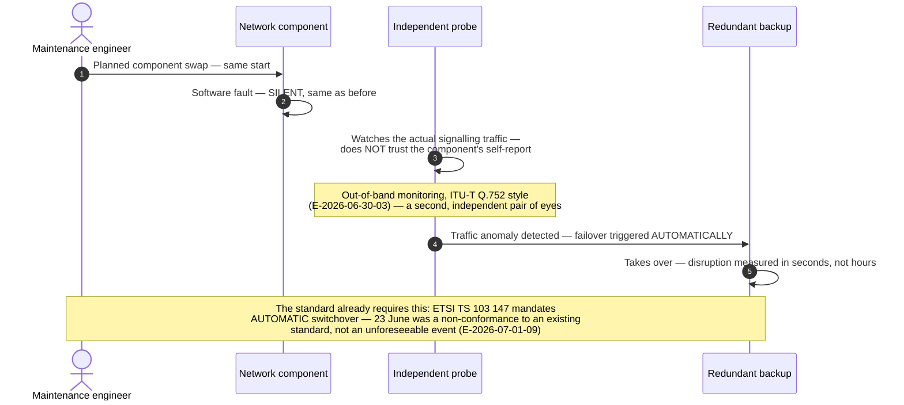

# Architecture Diagram: Anatomy of a silent fault — and the fix

> **Template Origin**: Official | **ArcKit Version**: 5.11.0 | **Command**: `/arckit:diagram`
> Pivot thread 1 visual (`../pivot-notes-2026-07-02.md`). Companion to `../silent-fault-failover-cascade-sequence.md` (earlier working sketch) and DIAG-001.

## Document Control

| Field | Value |
|---|---|
| Document ID | ARC-FRMCS-DIAG-002-v1.0 |
| Document Type | Architecture Diagram (Sequence, two panels) |
| Project | FRMCS arcKit — GSM-R→FRMCS transition + agentic oversight |
| Classification | PUBLIC |
| Status | DRAFT |
| Version | 1.0 |
| Created Date | 2026-07-02 |
| Last Modified | 2026-07-02 |
| Review Cycle | On evidence change |
| Next Review Date | 2026-08-01 |
| Owner | Vpnet engagement lead |
| Reviewed By | PENDING |
| Approved By | PENDING |
| Distribution | Engagement records; article/letter drafting inputs (pivot thread 1) |

## Revision History

| Version | Date | Author | Changes | Approved By | Approval Date |
|---------|------|--------|---------|-------------|---------------|
| 1.0 | 2026-07-02 | ArcKit AI | Initial creation from `/arckit:diagram` command (pivot thread 1 visual) | PENDING | PENDING |

---

## Purpose (layman audience)

The core lesson of 23 June in two panels: the backup was real and functional — what failed was the *trigger*. A component that lies about its health cannot be its own alarm. Panel 1 shows what happened; Panel 2 shows the same start with an independent listener, and a different ending.

## Panel 1 — What happened on 23 June

## Panel 2 — The fix: an independent listener

**View**: GitHub renders both panels automatically; export via https://mermaid.live.

**Caption (for reuse):** *"Prove the trigger fires — not that the backup exists."*

---

## Legend / key

| Term | Layman meaning |
|---|---|
| Silent fault | A failure that raises no alarm — monitoring stays green, so automatic protections are never told to act |
| Self-report | The component's own statement about its health — worthless when the component itself is what failed |
| Independent probe (out-of-band) | A separate listener on the actual traffic that does not depend on the failed component being honest (ITU-T Q.752 pattern) |
| Automatic failover | The backup takes over without a human having to notice first — mandated for this subsystem by ETSI TS 103 147 |

## Key statements (and their evidence)

1. **The redundancy existed and worked; its trigger had never been exercised against a fault that stays silent.** (E-2026-06-27-01/-02/-03; ADR-007's core principle.)
2. **Health-driven failover fails when the component lies about its health.** Detection must be independent of the element's self-report. (PR5/PR11; E-2026-06-30-03.)
3. **Automatic switchover is already normative.** ETSI TS 103 147 §4.2 requires it and §4.1 names maintenance among the events redundancy must cover — 23 June was a non-conformance, not bad luck. (E-2026-07-01-09.)
4. **Calculated availability is not evidence.** The same estate had very high calculated availability (E-2026-06-25-02) and still stood still for ~2 hours. Test the trigger (ADR-007 surfaces (a)–(c)).

## Honesty constraints (binding on any reuse)

- Panel 2 is a **design argument, not a reconstruction** — DB has not published full telemetry; the replay corpus is inference-based until it does (PR8).
- Do not conflate this **element-class** automatic failover with **disaster-class** site switchover, which DB deliberately keeps manual-and-practised (E-2026-07-02-25; PR11 failover taxonomy).
- The common-mode caveat travels with the fix: if primary and backup run identical code/config, a bad change defeats both regardless of the trigger — diversity/staged rollout required on top (PR11).

## Requirements traceability

| Requirement | Shown as | Coverage |
|-------------|----------|----------|
| R3 (no central SPOF) | Single component's silent fault defeating nationwide service | ✅ core |
| R4 (fail-soft) | Hours-vs-seconds contrast between the panels | ✅ core |
| R12 (awareness gap) | "No alarm" — the gap the Risk Sentinel exists to close | ✅ context |
| PR5/PR11 | Independent out-of-band detection as the load-bearing fix | ✅ core |

**Evidence refs:** E-2026-06-27-01/-02/-03 · E-2026-06-30-03 · E-2026-07-01-09 · E-2026-06-25-02 · E-2026-07-02-25 (taxonomy caveat) · ADR-007 · PR11.

## Quality gate (Step 5d)

| # | Criterion | Target | Result | Status |
|---|-----------|--------|--------|--------|
| 1 | Edge crossings | 0 | 0 in both panels | PASS |
| 2 | Visual hierarchy | The lie ("all green") and the fix (probe→backup) visually central | Notes placed at those two moments | PASS |
| 3 | Grouping | Panels separated | Two self-contained diagrams, parallel casts | PASS |
| 4 | Flow direction | Consistent | Top-to-bottom, same actor order in both panels | PASS |
| 5 | Relationship traceability | Unambiguous | ≤6 messages per panel, autonumbered | PASS |
| 6 | Abstraction level | One level | Operational scenario level | PASS |
| 7 | Edge label readability | Legible | Long text in Notes; labels ≤1 line | PASS |
| 8 | Node placement | Proximate | PRB adjacent to CMP and BAK (its two relationships) | PASS |
| 9 | Element count | ≤8 lifelines | 4/8 per panel | PASS |

## Linked artifacts

**Narrative**: `../pivot-notes-2026-07-02.md` (thread 1) · **Prompt**: `../pivot-prompts-2026-07-02.md` · **Incident**: `../../incident-annex.md` · **Strategy**: `../ADR-007-testing-canary-strategy.md` · **Risks**: `../03-risk-register.md` (PR5/PR8/PR11) · **Sidebar**: run `/arckit:impact PR11` for the blast-radius table.

---

**Generated by**: ArcKit `/arckit:diagram` command
**Generated on**: 2026-07-02
**ArcKit Version**: 5.11.0
**Project**: FRMCS arcKit (custom layout)
**AI Model**: claude-fable-5
**Generation Context**: incident-annex.md + E-2026-06-27-01/-02/-03, E-2026-06-30-03, E-2026-07-01-09, E-2026-06-25-02; pivot thread 1
