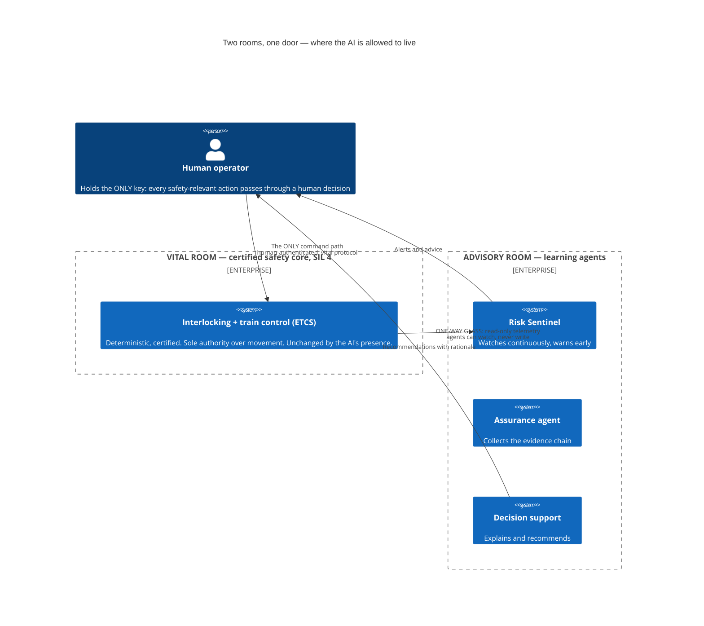

# Architecture Diagram: Two rooms, one door — where the AI is allowed to live

> **Template Origin**: Official | **ArcKit Version**: 5.11.0 | **Command**: `/arckit:diagram`
> Pivot thread 2 visual (`../pivot-notes-2026-07-02.md`). Companion to `../oversight-sil4-boundary-context.md` and `../../diagrams/agentic-governance-*.svg` (house style).

## Document Control

| Field | Value |
|---|---|
| Document ID | ARC-FRMCS-DIAG-003-v1.0 |
| Document Type | Architecture Diagram (C4 Context) |
| Project | FRMCS arcKit — GSM-R→FRMCS transition + agentic oversight |
| Classification | PUBLIC |
| Status | DRAFT |
| Version | 1.0 |
| Created Date | 2026-07-02 |
| Last Modified | 2026-07-02 |
| Review Cycle | On ADR-004 change |
| Next Review Date | 2026-08-01 |
| Owner | Vpnet engagement lead |
| Reviewed By | PENDING |
| Approved By | PENDING |
| Distribution | Engagement records; article/letter drafting inputs (pivot thread 2) |

## Revision History

| Version | Date | Author | Changes | Approved By | Approval Date |
|---------|------|--------|---------|-------------|---------------|
| 1.0 | 2026-07-02 | ArcKit AI | Initial creation from `/arckit:diagram` command (pivot thread 2 visual) | PENDING | PENDING |

---

## Purpose (layman audience)

The signature visual for the AI-oversight argument: the learning AI lives in an **advisory room** behind one-way glass — it sees everything, it can warn and explain, but it cannot touch anything. The **vital room** (the certified safety core) is unchanged by the AI's presence, and a **human holds the only key** between advice and action. Oversight, not control.

## Diagram — PlantUML (print-quality primary)

```plantuml
@startuml
!include https://raw.githubusercontent.com/plantuml-stdlib/C4-PlantUML/master/C4_Context.puml

title Two rooms, one door — where the AI is allowed to live

Person(human, "Human operator", "Holds the ONLY key: every safety-relevant action passes through a human decision. The agent cannot close the loop.")

System_Boundary(vital, "VITAL ROOM — certified safety core (SIL 4)") {
    System(kernel, "Interlocking + train control (ETCS)", "Deterministic, certified to the highest safety level. Sole authority over movement. Unchanged by the AI's presence.")
}

System_Boundary(adv, "ADVISORY ROOM — learning agents (oversight, not control)") {
    System(sentinel, "Risk Sentinel", "Watches continuously, warns before thresholds")
    System(assure, "Assurance agent", "Collects the evidence chain for the safety case")
    System(support, "Decision support", "Explains and recommends, with legible rationale")
}

Rel_Right(kernel, sentinel, "ONE-WAY GLASS: read-only telemetry", "agents can watch, never write")
Rel_Down(sentinel, human, "Alerts and advice")
Rel_Down(support, human, "Recommendations with rationale")
Rel_Up(human, kernel, "The ONLY command path", "human-authenticated, vital protocol")

Lay_Right(sentinel, assure)
Lay_Right(assure, support)

@enduml
```

**View (PlantUML does NOT render on GitHub)**: https://www.plantuml.com/plantuml/uml/ · VS Code PlantUML extension · `java -jar plantuml.jar`.

## Diagram — Mermaid (GitHub-rendered fallback)



**Caption (for reuse):** *"Oversight, not control. The boundary is also the legal argument: the EU AI Act 'not high-risk' classification holds only while the AI cannot act."*

---

## The pattern is the sector's own — three adoptions in the operator's words

| # | Adoption | The operator's own framing | Evidence |
|---|----------|---------------------------|----------|
| 1 | CTMS — DB's flagship AI traffic management | "not being designed as a safety-critical system"; safety responsibility lies with the interlocking-operating system (APS) | E-2026-07-02-14 |
| 2 | AutomatedTrain (GoA-4 localisation) | deliberate decision: **no AI-based algorithms in safety-critical paths** — deterministic landmark localisation preferred | E-2026-07-02-19 |
| 3 | iLBS — in operation ~1 year | non-safety operating layer over a safety-enforcing vital interlocking; operator hardware non-SIL/COTS with simplified approval | E-2026-07-02-09 |

Platform evolution beneath the vital room: E-2026-07-02-01 → -03 → -27 (Cloud4Rail — untrusted COTS virtualisation + certified application-level safety layer; learning-component co-hosting explicitly NOT covered).

## Key statements (and their evidence)

1. **Three separation properties by construction, not procedure** (ADR-004): unidirectional information flow (one-way glass), human-in-command interposition (the key), freedom from interference (physical segregation preferred).
2. **The boundary is the compliance argument.** The EU AI Act Article 3(14) "not a safety component" finding (ADR-003, conditional — never assert as automatic) holds only while the agents are non-actuating. Boundary breach → safety component → high-risk → SIL 4 for a learning system → infeasible. (E-2026-06-24-07.)
3. **The residual risk is the human, not the machine** — automation bias: an advisory system can still contribute to harm if the human rubber-stamps. That is thread 3's alert-budget answer (PR4; DIAG-004).

## Honesty constraints (binding on any reuse)

- ADR-004 status is **Proposed**: the boundary is *designed*, not yet *evidenced* — the FFI/independence analysis, hazard log and ISA/NoBo assessments are open action items. Say "designed and industry-corroborated", not "proven".
- Never assert the EU AI Act classification as settled fact (CLAUDE.md guardrail); it is verified-conditional (E-2026-06-24-07) and rides on this boundary.
- Do not blur "oversight, not control" — safety-critical actuation stays human-in-command, verbatim.

## Requirements traceability

| Requirement | Shown as | Coverage |
|-------------|----------|----------|
| R9 (autonomy as separate layer) | The advisory room as a distinct, removable layer | ✅ core |
| R10 (human oversight proportional to risk) | The human as the only door between advice and action | ✅ core |
| R11 (certifiable safety case) | The vital room's untouched certified kernel | ✅ core |
| R12 (awareness gap) | Risk Sentinel watching through the one-way glass | ✅ context |

**Evidence refs:** ADR-004 (boundary design) · ADR-003/E-2026-06-24-07 (AI Act, conditional) · E-2026-07-02-14/-19/-09 (in-domain adoptions) · E-2026-07-02-01/-03/-27 (platform design basis).

## Quality gate (Step 5d)

| # | Criterion | Target | Result | Status |
|---|-----------|--------|--------|--------|
| 1 | Edge crossings | 0 (simple, ≤6 elements) | 0 — four relationships, star-shaped around the human | PASS |
| 2 | Visual hierarchy | The two boundaries dominate | Two named rooms; the human outside both | PASS |
| 3 | Grouping | Related elements proximate | Three agents grouped in the advisory boundary | PASS |
| 4 | Flow direction | Consistent | Vital left → advisory right (telemetry); advice down to human; command up to kernel | PASS |
| 5 | Relationship traceability | Unambiguous | 4 labelled relationships, distinct paths | PASS |
| 6 | Abstraction level | One C4 level | Context (L1) only | PASS |
| 7 | Edge label readability | Legible | Labels ≤2 lines; adoption detail moved to table | PASS |
| 8 | Node placement | Proximate | Kernel adjacent to sentinel (the read path); human adjacent to both rooms | PASS |
| 9 | Element count | ≤10 (Context) | 5/10 | PASS |

PlantUML check: all relationships directional (`Rel_Right/Down/Up`), `Lay_Right` aligns the three agents, no `Rel`/`Lay` conflicts (kernel left of sentinel; human below both rooms).

## Linked artifacts

**Narrative**: `../pivot-notes-2026-07-02.md` (thread 2) · **Boundary ADR**: `../ADR-004-sil4-boundary.md` · **Classification ADR**: `../ADR-003-eu-ai-act-classification.md` · **Context note**: `../oversight-sil4-boundary-context.md` · **House-style SVGs**: `../../diagrams/agentic-governance-light.svg` / `-dark.svg`.

---

**Generated by**: ArcKit `/arckit:diagram` command
**Generated on**: 2026-07-02
**ArcKit Version**: 5.11.0
**Project**: FRMCS arcKit (custom layout)
**AI Model**: claude-fable-5
**Generation Context**: ADR-004, ADR-003 + E-2026-07-02-14/-19/-09/-01/-03/-27; pivot thread 2
