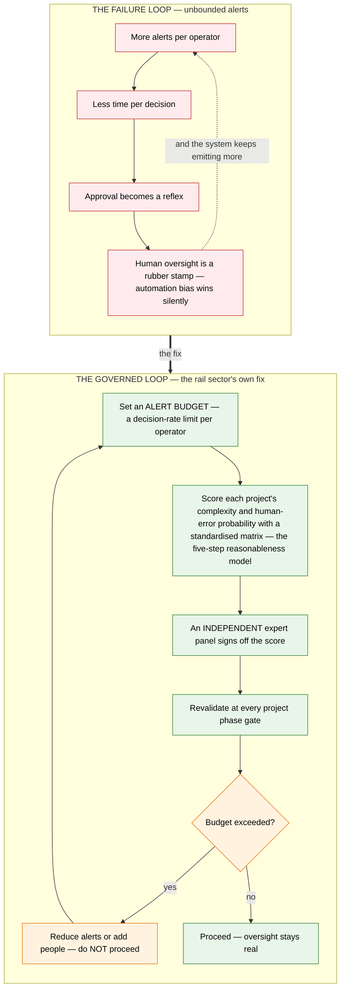

# Architecture Diagram: Why unlimited alerts make humans rubber-stamp — and the fix

> **Template Origin**: Official | **ArcKit Version**: 5.11.0 | **Command**: `/arckit:diagram`
> Pivot thread 3 visual (`../pivot-notes-2026-07-02.md`).

## Document Control

| Field | Value |
|---|---|
| Document ID | ARC-FRMCS-DIAG-004-v1.0 |
| Document Type | Architecture Diagram (Flowchart, two loops) |
| Project | FRMCS arcKit — GSM-R→FRMCS transition + agentic oversight |
| Classification | PUBLIC |
| Status | DRAFT |
| Version | 1.0 |
| Created Date | 2026-07-02 |
| Last Modified | 2026-07-02 |
| Review Cycle | On PR4 / Zumutbarkeit-thread change |
| Next Review Date | 2026-08-01 |
| Owner | Vpnet engagement lead |
| Reviewed By | PENDING |
| Approved By | PENDING |
| Distribution | Engagement records; article/letter drafting inputs (pivot thread 3) |

## Revision History

| Version | Date | Author | Changes | Approved By | Approval Date |
|---------|------|--------|---------|-------------|---------------|
| 1.0 | 2026-07-02 | ArcKit AI | Initial creation from `/arckit:diagram` command (pivot thread 3 visual) | PENDING | PENDING |

---

## Purpose (layman audience)

Human oversight fails quietly when the human is overloaded. This visual shows the failure loop (unbounded alerts → reflex approvals → automation bias wins) and the governed loop the rail sector itself is building: a quantified "reasonableness" budget for how much deciding you may ask of one person, scored by an independent panel and revalidated at every phase.

## Diagram

**View**: GitHub renders automatically; export via https://mermaid.live.

**Caption (for reuse):** *"Human oversight is a resource with a capacity limit. The rail sector is writing that limit into its own safety process — an AI oversight layer should inherit it."*

---

## Legend / key

| Term | Layman meaning |
|---|---|
| Automation bias | Over-trusting a system's output — approving because the machine proposed it, not because you checked it |
| Alert budget / decision-rate limit | A hard cap on how many decisions per hour one person may be asked to make — beyond it, oversight is fiction |
| Reasonableness (Zumutbarkeit) model | The rail sector's five-step method: complexity + human-error scoring (VDI 4006), complexity classes, an independent expert panel, improvement factors, anchoring in the safety process (extended CSM per Ril 809) with phase-gate revalidation |
| Independent expert panel | People with no stake in the schedule signing off that the workload is humanly reasonable |

## Key statements (and their evidence)

1. **Overload is the mechanism by which rubber-stamping wins.** Dissent-rate metrics alone cannot save oversight if the decision load is unbounded. (PR4 LOAD BOUND; E-2026-07-02-13.)
2. **The fix is not AI-ethics hand-waving — it is the sector's own instrument.** The TU-Dresden/DB proposal adds a REASONABLENESS factor to the CSM-RA significance test; the five-step operationalisation exists (matrix, panel, phase anchoring). (E-2026-07-02-13/-23.)
3. **The design culture already validates safe defaults.** Under uncertainty, the validated behaviour is *don't acknowledge* — and the system degrades to a supervised stop (E-2026-07-02-24); report "unknown", never coast on stale "confirmed" (E-2026-07-02-29).
4. **Coupling:** the reasonableness factor enters through change governance (ADR-011/CSM-RA) and lands in ADR-004's automation-bias hazard analysis — the boundary (DIAG-003) holds only if the human is a genuine decision-maker.

## Honesty constraints (binding on any reuse)

- The five-step model is **ongoing research** — dissertations and pilots pending, not adopted regulation (E-2026-07-02-23). Say "the sector is writing", not "the sector has written".
- Interest note carried from the log: CERSS (inspection-services company) co-authors the source articles — flagged colouring, not disqualification.

## Requirements traceability

| Requirement | Shown as | Coverage |
|-------------|----------|----------|
| R10 (human oversight proportional to risk) | The whole governed loop | ✅ core |
| PR4 (automation bias) | The failure loop + budget-exceeded gate | ✅ core |
| ADR-011 (change control) | Phase-gate revalidation via the extended CSM process | ✅ context |
| ADR-004 (boundary) | Precondition: human as genuine decision-maker | ✅ context |

**Evidence refs:** E-2026-07-02-13 (Zumutbarkeit criteria + CSM-RA reasonableness proposal) · E-2026-07-02-23 (five-step operationalisation) · E-2026-07-02-24 (validated safe default) · E-2026-07-02-29 (tri-state honesty) · PR4 (risk register).

## Quality gate (Step 5d)

| # | Criterion | Target | Result | Status |
|---|-----------|--------|--------|--------|
| 1 | Edge crossings | 0 (simple) | 0 — two self-contained loops, one connector | PASS |
| 2 | Visual hierarchy | Failure vs fix instantly distinguishable | Red-tinted loop vs green-tinted loop, bold connector | PASS |
| 3 | Grouping | Loops separated | Two subgraphs with `direction TB` | PASS |
| 4 | Flow direction | Consistent | TB inside both loops; single LOOP1→LOOP2 connector | PASS |
| 5 | Relationship traceability | Unambiguous | Linear chains + one labelled decision node | PASS |
| 6 | Abstraction level | One level | Process/causal level throughout | PASS |
| 7 | Edge label readability | Legible | Edge labels ≤6 words, comma-free, no line breaks | PASS |
| 8 | Node placement | Proximate | Loop-back edges (A4→A1, B6→B1) within their subgraphs | PASS |
| 9 | Element count | ≤12 (flowchart) | 11/12 | PASS |

## Linked artifacts

**Narrative**: `../pivot-notes-2026-07-02.md` (thread 3) · **Risk**: `../03-risk-register.md` (PR4) · **Change control**: `../ADR-011-migration-change-control.md` · **Boundary**: `../ADR-004-sil4-boundary.md` (automation-bias hazard) · **Eval**: `../ADR-010-eval-strategy.md`.

---

**Generated by**: ArcKit `/arckit:diagram` command
**Generated on**: 2026-07-02
**ArcKit Version**: 5.11.0
**Project**: FRMCS arcKit (custom layout)
**AI Model**: claude-fable-5
**Generation Context**: PR4 + E-2026-07-02-13/-23/-24/-29; pivot thread 3
