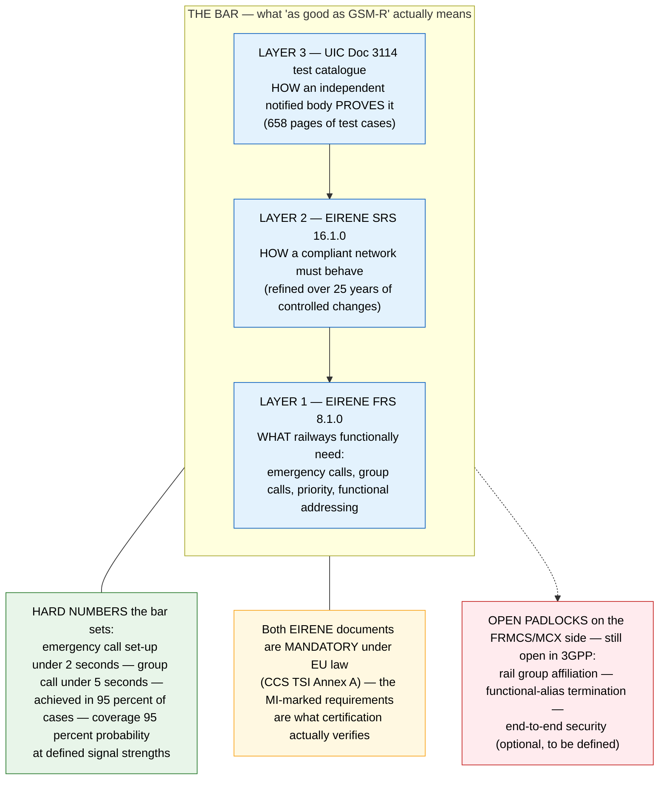
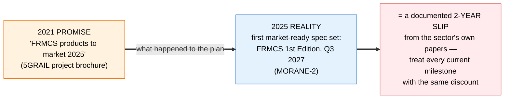

# Architecture Diagram: Equivalence to what, exactly? The bar FRMCS must clear

> **Template Origin**: Official | **ArcKit Version**: 5.11.0 | **Command**: `/arckit:diagram`
> Pivot thread 4 visual (`../pivot-notes-2026-07-02.md`).

## Document Control

| Field | Value |
|---|---|
| Document ID | ARC-FRMCS-DIAG-005-v1.0 |
| Document Type | Architecture Diagram (Layered flowchart + timeline strip) |
| Project | FRMCS arcKit — GSM-R→FRMCS transition + agentic oversight |
| Classification | PUBLIC |
| Status | DRAFT |
| Version | 1.0 |
| Created Date | 2026-07-02 |
| Last Modified | 2026-07-02 |
| Review Cycle | On PR15 / MORANE-2 milestone change |
| Next Review Date | 2026-08-01 |
| Owner | Vpnet engagement lead |
| Reviewed By | PENDING |
| Approved By | PENDING |
| Distribution | Engagement records; article/letter drafting inputs (pivot thread 4) |

## Revision History

| Version | Date | Author | Changes | Approved By | Approval Date |
|---------|------|--------|---------|-------------|---------------|
| 1.0 | 2026-07-02 | ArcKit AI | Initial creation from `/arckit:diagram` command (pivot thread 4 visual) | PENDING | PENDING |

---

## Purpose (layman audience)

"FRMCS must be as good as GSM-R" only means something if you can point at the bar. This visual stacks the three documents that ARE the bar, badges the hard numbers, marks the three gaps still open on the FRMCS side — and the timeline strip shows the clock has already slipped two years, per the sector's own papers.

## Diagram — the bar

## Diagram — the timeline strip (the clock has already slipped)

**View**: GitHub renders both automatically; export via https://mermaid.live. The timeline strip works standalone as a letter graphic.

**Caption (for reuse):** *"'As good as GSM-R' is measurable — and the clock that measures it has already slipped two years."*

---

## Legend / key

| Term | Layman meaning |
|---|---|
| EIRENE FRS / SRS | The two UIC specifications defining what railway radio must do (FRS) and how a compliant network must behave (SRS) — the pair is mutually consistency-assured |
| CCS TSI Annex A / (MI)-marked | The EU legal instrument that makes them mandatory; only requirements marked (MI) are what certification verifies — the honest scope of "binding" |
| UIC Doc 3114 | The 658-page harmonised test catalogue a notified body (independent assessor) uses to prove a network conforms |
| MCX | The 3GPP mission-critical service family FRMCS uses to reproduce GSM-R's railway features |
| FRMCS 1st Edition (V3) | The first specification set complete enough to buy against — planned Q3 2027 |

## Key statements (and their evidence)

1. **The bar is real, layered, and legally anchored**: FRS 8.1.0 (E-2026-07-02-30) + SRS 16.1.0 (E-2026-07-02-31), both CCS TSI Annex A mandatory; proven via the UIC 3114 NoBo catalogue (E-2026-07-02-32); DB's operational bar alongside (Ril 481.0205, E-2026-06-24-18).
2. **The bar is quantified**: REC set-up under 2 s, group under 5 s, in 95 percent of cases, 99th percentile within 1.5×; coverage probability bars at defined signal strengths. Any "equivalent" MCX service meets these or consciously re-baselines. (E-2026-07-02-32.)
3. **Three named gaps remain open on the FRMCS side**: rail group affiliation (Rel-16/CT1 in progress), functional-alias termination, E2E security optional/to-be-defined. (E-2026-07-01-10; PR15.)
4. **The timeline has already slipped ~2 years** across the sector's own documents: products "planned 2025" (E-2026-07-02-28, c.2021) vs spec-ready Q3 2027 (E-2026-07-02-15). Calibration for R1's obsolescence window and R13's migration window.

## Honesty constraints (binding on any reuse)

- Only **(MI)-marked** EIRENE requirements are certification-binding — treating all EIRENE text as equally normative overstates the bar (E-2026-07-02-30 foreword).
- UIC 3114 is a 2013 **final draft** on superseded baselines — the methodology and KPIs stand; specific test cases need currency-checking before reliance (E-2026-07-02-32).
- MCX equivalence is **validated-in-progress, not failed** (E-2026-06-29-01) — the padlocks are open items, not verdicts.
- The 2-year slip compares a dissemination brochure's plan (A/B tier) with a project article's plan (A/C) — both are the sector's own statements, but both are *plans*; phrase as "documented slip in the announced timeline".

## Requirements traceability

| Requirement | Shown as | Coverage |
|-------------|----------|----------|
| PR15 (MCX feature equivalence) | The whole bar + padlocks | ✅ core |
| R5/R2 (capability + no service break) | The functional layer (L1) contents | ✅ context |
| R7 (interoperability/TSI conformance) | The CCS-TSI-mandatory anchor | ✅ context |
| R1/R13 (obsolescence window / migration feasibility) | The timeline slip as calibration | ✅ core |
| ADR-007(e) | The regression suite this bar defines | ✅ context |

**Evidence refs:** E-2026-07-02-30/-31/-32 (the bar) · E-2026-07-01-10 (MCX gaps) · E-2026-06-24-18 (DB operational bar) · E-2026-07-02-28 vs E-2026-07-02-15 (slip) · E-2026-06-29-01 (equivalence in progress) · PR15 · ADR-007 surface (e).

## Quality gate (Step 5d)

| # | Criterion | Target | Result | Status |
|---|-----------|--------|--------|--------|
| 1 | Edge crossings | 0 (simple) | 0 in both blocks | PASS |
| 2 | Visual hierarchy | The three-layer bar dominates | Boxed subgraph with colour-coded satellites (KPI green, law amber, gaps red) | PASS |
| 3 | Grouping | Layers stacked, satellites attached | Subgraph + three attached nodes; timeline separate | PASS |
| 4 | Flow direction | Consistent | TB for the bar stack; LR for the timeline | PASS |
| 5 | Relationship traceability | Unambiguous | 5 + 2 edges, no crossings | PASS |
| 6 | Abstraction level | One level | Document/standard level throughout | PASS |
| 7 | Edge label readability | Legible | One short edge label; all detail in node text | PASS |
| 8 | Node placement | Proximate | Satellites adjacent to the bar; timeline linear | PASS |
| 9 | Element count | ≤12 (flowchart) | 6 + 3 = within threshold per block | PASS |

## Linked artifacts

**Narrative**: `../pivot-notes-2026-07-02.md` (thread 4) · **Risk**: `../03-risk-register.md` (PR15) · **Test strategy**: `../ADR-007-testing-canary-strategy.md` (surface (e)) · **Transition ADR**: `../../ADR-001-gsmr-to-frmcs.md` (§1.4 equivalence).

---

**Generated by**: ArcKit `/arckit:diagram` command
**Generated on**: 2026-07-02
**ArcKit Version**: 5.11.0
**Project**: FRMCS arcKit (custom layout)
**AI Model**: claude-fable-5
**Generation Context**: E-2026-07-02-30/-31/-32, E-2026-07-01-10, E-2026-07-02-28 vs -15; pivot thread 4
