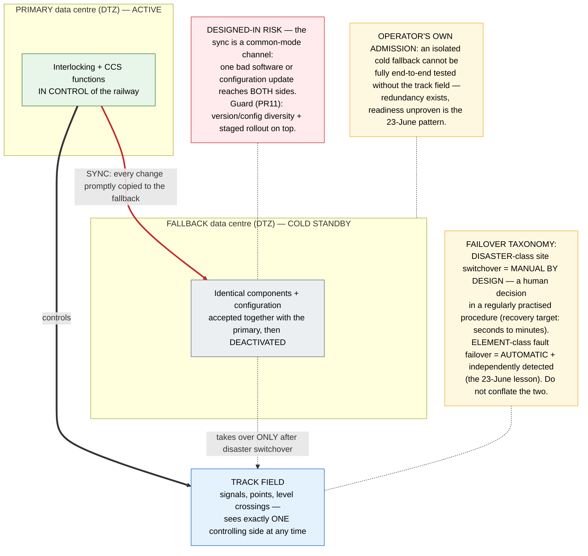

# Architecture Diagram: The target ground estate — and its one designed-in risk

> **Template Origin**: Official | **ArcKit Version**: 5.11.0 | **Command**: `/arckit:diagram`
> Pivot thread 5 companion visual (`../pivot-notes-2026-07-02.md`); the thread-5 Wardley map itself is a separate `/arckit:wardley` update pass on `../wardley-gsmr-frmcs-transition.md`.

## Document Control

| Field | Value |
|---|---|
| Document ID | ARC-FRMCS-DIAG-006-v1.0 |
| Document Type | Architecture Diagram (Deployment) |
| Project | FRMCS arcKit — GSM-R→FRMCS transition + agentic oversight |
| Classification | PUBLIC |
| Status | DRAFT |
| Version | 1.0 |
| Created Date | 2026-07-02 |
| Last Modified | 2026-07-02 |
| Review Cycle | On R3/PR11 evidence change |
| Next Review Date | 2026-08-01 |
| Owner | Vpnet engagement lead |
| Reviewed By | PENDING |
| Approved By | PENDING |
| Distribution | Engagement records; article/letter drafting inputs (pivot threads 1+5) |

## Revision History

| Version | Date | Author | Changes | Approved By | Approval Date |
|---------|------|--------|---------|-------------|---------------|
| 1.0 | 2026-07-02 | ArcKit AI | Initial creation from `/arckit:diagram` command (pivot thread 5 companion) | PENDING | PENDING |

---

## Purpose (layman audience)

DB InfraGO's own target picture for protecting the centralised signalling estate against site loss (fire, flood, deliberate destruction): two data centres, one in control at any time, the second a cold standby. It is a sound doctrine — **and it contains one designed-in risk our records flag**: keeping the fallback ready means copying every change to it, which is exactly the channel through which one bad update can reach both sides.

## Diagram

**View**: GitHub renders automatically; export via https://mermaid.live.

**Caption (for reuse):** *"Geo-redundancy against destruction — but identical software on both sides is the sameness the 23-June lesson warns about."*

---

## Legend / key

| Term | Layman meaning |
|---|---|
| DTZ (digital technology centre) | The data centre where digitalised interlocking/signalling logic runs — centralisation's efficiency and its concentrated risk |
| Cold standby | The fallback exists fully built and pre-approved but switched off — no fresh approval needed in a disaster, fast to activate |
| Common-mode channel | Any path by which one cause can defeat both the primary and its backup at once — here, the change-sync that keeps the fallback current |
| Disaster-class vs element-class failover | Losing a whole site (rare, evident, human-decided) vs one component failing silently (must be detected independently and switched automatically) |
| Zielbild (target picture) | DB's long-term aim: warm standby on virtualisation (Cloud4Rail) — fallback instances running at reduced resources, syncing live state |

## Key statements (and their evidence)

1. **The doctrine is the operator's own**: cold standby now (works with today's approved products; the track field only ever sees one controlling side), virtualised warm standby as the long-term Zielbild, geographically distributed 2-of-3 voting **rejected** for regular-operation availability loss. (E-2026-07-02-25.)
2. **Disaster switchover is manual by design** — "not because automatic is impossible, but because this serious decision should always be made by a human in a tried and tested procedure" — while element-class failover must stay automatic (TS 103 147). The taxonomy prevents each rule being misused to justify the other's opposite. (E-2026-07-02-25; E-2026-07-01-09; PR11.)
3. **The designed-in risk is ours to flag, from the record**: prompt change-sync = identical code/config on both sides = one bad update reaches both (the 2024-monoculture pattern PR11 guards against); and DB's own candour that an isolated cold fallback cannot be fully end-to-end tested restates the exists-vs-proven gap ADR-007 tests for.
4. **KRITIS/BSI requires this** (deliberate destruction named as a driver) — the R14 adjacency.

## Honesty constraints (binding on any reuse)

- This is a **target picture, not an implementation** — standardisation and development steps remain (sync protocols, controlled activation, fallback monitoring). R3 stays open.
- The common-mode critique is **our analysis applied to their design** (PR11 lens) — the source article does not itself discuss it; attribute accordingly.
- This is the **signalling/interlocking estate (DTZ)** — the adjacent domain to the FRMCS 5GC/IMS core (E-2026-07-01-12); same design question, different subsystem. Don't present one as the other.

## Requirements traceability

| Requirement | Shown as | Coverage |
|-------------|----------|----------|
| R3 (no central SPOF) | The geo-redundant two-site doctrine | ✅ core |
| PR11 (silent-fault/common-mode) | The red sync channel + untestable-fallback note | ✅ core |
| R4 (fail-soft) | Recovery target seconds-to-minutes vs 23-June's hours | ✅ context |
| R14 (KRITIS/cyber) | Deliberate-destruction driver | ✅ context |
| ADR-007 (prove by test) | "Readiness unproven is the 23-June pattern" | ✅ context |

**Evidence refs:** E-2026-07-02-25 (geo-redundancy doctrine) · E-2026-07-01-09 (TS 103 147 automatic-switchover mandate) · E-2026-07-01-12 (FRMCS core adjacency) · E-2026-07-02-01/-03/-27 (virtualisation platform family beneath the Zielbild) · PR11 · ADR-007.

## Quality gate (Step 5d)

| # | Criterion | Target | Result | Status |
|---|-----------|--------|--------|--------|
| 1 | Edge crossings | 0 (simple) | 0 — three main edges + three dotted annotation links | PASS |
| 2 | Visual hierarchy | The red sync channel is the point | Only red-styled, thickest edge; RISK node red | PASS |
| 3 | Grouping | Sites boxed | Two DTZ subgraphs; track field below | PASS |
| 4 | Flow direction | Consistent | TB: sites above, track field below; sync horizontal between sites | PASS |
| 5 | Relationship traceability | Unambiguous | 6 edges, each labelled or annotation-dotted | PASS |
| 6 | Abstraction level | One level | Deployment/site level | PASS |
| 7 | Edge label readability | Legible | Labels short; detail in note nodes | PASS |
| 8 | Node placement | Proximate | Annotations adjacent to their subjects | PASS |
| 9 | Element count | ≤15 (deployment) | 6/15 | PASS |

## Linked artifacts

**Narrative**: `../pivot-notes-2026-07-02.md` (threads 1+5) · **Doctrine evidence**: E-2026-07-02-25 (`../../evidence-log.md`) · **Risk**: `../03-risk-register.md` (PR11) · **Test strategy**: `../ADR-007-testing-canary-strategy.md` · **Wardley companion (pending)**: `/arckit:wardley` update of `../wardley-gsmr-frmcs-transition.md` per `../pivot-prompts-2026-07-02.md` thread 5.

---

**Generated by**: ArcKit `/arckit:diagram` command
**Generated on**: 2026-07-02
**ArcKit Version**: 5.11.0
**Project**: FRMCS arcKit (custom layout)
**AI Model**: claude-fable-5
**Generation Context**: E-2026-07-02-25 + E-2026-07-01-09/-12, PR11, ADR-007; pivot threads 1+5
