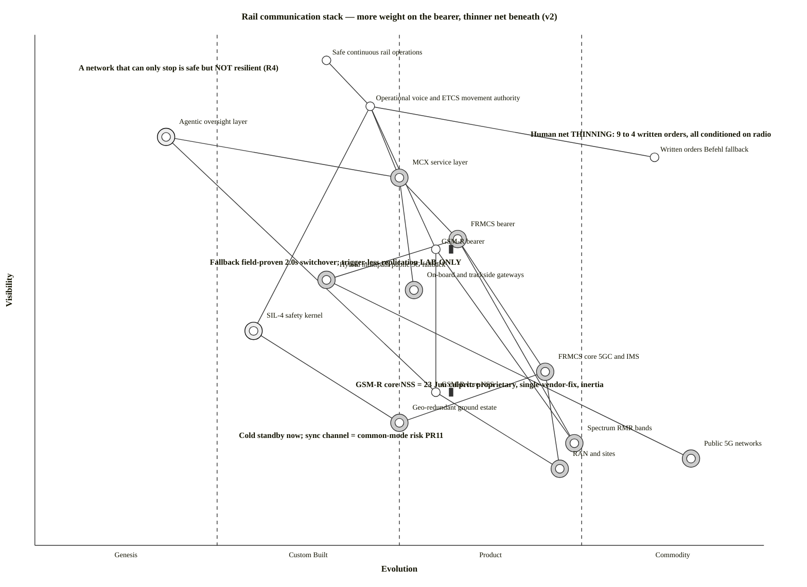

# Wardley Map — rail communication stack: more weight on the bearer, thinner net beneath (v2)

**Date:** 2026-07-02 (v2 — pivot thread 5 update; v1 2026-06-30) · **Status:** Draft · **Owner:** Vpnet engagement lead · **Review:** 2026-08-01
**Command:** `/arckit:wardley` (adapted — saved in `current/` spine, not the plugin `projects/` scaffold)
**Strategic question (v2):** the v1 build/buy + lock-in question, PLUS pivot thread 5 — *safety functions are migrating onto the radio bearer while the human-procedural net beneath it thins; where does that leave R3/R4?*
**Grounding (evidence):** v1 set (E-2026-06-27-01/-03/-05, E-2026-06-29-01/-02, E-2026-06-24-04) **plus the 07-02 wave**: E-2026-07-02-26 (written orders: 9→4, all conditioned on radio), E-2026-07-02-10/-21 (5G-RACOM design + field results: 2.0 s switchover proven, trigger-less replication lab-only), E-2026-07-02-25 (geo-redundant ground estate: cold standby now, virtualised warm-standby Zielbild), E-2026-07-02-15 (MORANE-2 carries multipath into European validation), E-2026-07-02-28 vs -15 (timeline slip). Matrix rows R3/R4 (both open). Positions are analytical judgement grounded in these — not externally surveyed.
**Layman reading:** top = what the public needs (safe, continuous trains); bottom = invisible infrastructure; left = novel/unproven; right = standardised/utility. Arrows on the OWM render show where things are moving.

## Map (paste into https://create.wardleymaps.ai)

```wardley
title Rail communication stack — more weight on the bearer, thinner net beneath (v2)
anchor Safe continuous rail operations [0.95, 0.40]

component Safe continuous rail operations [0.95, 0.40]
component Operational voice and ETCS movement authority [0.86, 0.46]
component Written orders Befehl fallback [0.76, 0.85]
component MCX service layer [0.72, 0.50]
component FRMCS bearer [0.60, 0.58]
component GSM-R bearer [0.58, 0.55] inertia
component Hybrid multipath public 5G fallback [0.52, 0.40]
component On-board and trackside gateways [0.50, 0.52]
component SIL-4 safety kernel [0.42, 0.30]
component FRMCS core 5GC and IMS [0.34, 0.70]
component GSM-R core NSS [0.30, 0.55] inertia
component Geo-redundant ground estate [0.24, 0.50]
component Spectrum RMR bands [0.20, 0.74]
component Public 5G networks [0.17, 0.90]
component RAN and sites [0.15, 0.72]
component Agentic oversight layer [0.80, 0.18]

Safe continuous rail operations -> Operational voice and ETCS movement authority
Operational voice and ETCS movement authority -> MCX service layer
Operational voice and ETCS movement authority -> GSM-R bearer
Operational voice and ETCS movement authority -> SIL-4 safety kernel
Operational voice and ETCS movement authority -> Written orders Befehl fallback
MCX service layer -> FRMCS bearer
MCX service layer -> On-board and trackside gateways
FRMCS bearer -> FRMCS core 5GC and IMS
FRMCS bearer -> Hybrid multipath public 5G fallback
Hybrid multipath public 5G fallback -> Public 5G networks
GSM-R bearer -> GSM-R core NSS
FRMCS bearer -> Spectrum RMR bands
GSM-R bearer -> Spectrum RMR bands
FRMCS core 5GC and IMS -> RAN and sites
FRMCS core 5GC and IMS -> Geo-redundant ground estate
SIL-4 safety kernel -> Geo-redundant ground estate
GSM-R core NSS -> RAN and sites
Agentic oversight layer -> MCX service layer
Agentic oversight layer -> GSM-R core NSS

evolve GSM-R bearer 0.92 label Decommission next decade
evolve FRMCS bearer 0.80 label Commoditising bearer
evolve MCX service layer 0.70 label First edition spec imminent
evolve Hybrid multipath public 5G fallback 0.62 label European validation underway
evolve Geo-redundant ground estate 0.70 label Virtualised warm standby
evolve Agentic oversight layer 0.42 label Build differentiator

build Agentic oversight layer
build SIL-4 safety kernel
buy FRMCS bearer
buy MCX service layer
buy On-board and trackside gateways
buy FRMCS core 5GC and IMS
buy Hybrid multipath public 5G fallback
buy Geo-redundant ground estate
buy Spectrum RMR bands
buy Public 5G networks
buy RAN and sites

note Human net THINNING: 9 to 4 written orders, all conditioned on radio [0.80, 0.68]
note Fallback field-proven 2.0s switchover; trigger-less replication LAB-ONLY [0.55, 0.24]
note A network that can only stop is safe but NOT resilient (R4) [0.93, 0.06]
note GSM-R core NSS = 23 Jun culprit: proprietary, single-vendor-fix, inertia [0.31, 0.44]
note Cold standby now; sync channel = common-mode risk PR11 [0.21, 0.28]

style wardley
```

<details>
<summary>Mermaid Wardley Map (converter output — positions and sourcing; evolution arrows visible in the OWM render above)</summary>



</details>

## What changed in v2 (the thread-5 story)

1. **The human net is now on the map — and it is thinning.** `Written orders Befehl fallback` [0.76, 0.85]: a commodity *practice* (harmonised EU-wide since 14 Dec 2025), but the target system keeps only **4 of 9** instructions, all conditioned on a working radio link (E-2026-07-02-26). The evolution axis cannot show scope shrinkage — the note carries it. This is the "thinner net" half of the thesis.
2. **The bearer's own safety net entered validation.** `Hybrid multipath public 5G fallback` [0.52, 0.40 → 0.62]: field-proven 2.0 s switchover at the Erzgebirge testbed, moving toward product as MORANE-2 carries it into European validation (E-2026-07-02-21/-15) — **but the trigger-less replication mode (the one that sidesteps the silent-fault detection problem) is lab-only**, so the fallback still depends on triggers firing (PR11's lesson).
3. **The ground estate got its doctrine.** `Geo-redundant ground estate` [0.24, 0.50 → 0.70]: cold standby with today's approved products, evolving to the virtualised warm-standby Zielbild via Cloud4Rail (E-2026-07-02-25/-27) — with the change-sync channel flagged as the designed-in common-mode risk (PR11).
4. **`Public 5G networks`** [0.17, 0.90] added as the commodity substrate the hybrid fallback rides on — with the standing R4 caveat that public networks cannot carry emergency/group calls without MCX re-provision (Ril 481.0205, E-2026-06-24-18).
5. **The v1 core insight stands unchanged**: GSM-R bearer + core NSS remain the stuck-product legacy trap that materialised on 23 June.

**The thread-5 synthesis:** safety functions migrate rightward *and upward onto the bearer* (written orders → technical solutions over radio; movement authority already there) while the procedural net beneath thins — so bearer availability (R3/R4) becomes more load-bearing every year of the transition. A network that can only stop is safe but not resilient; the anchor is *continuous* as well as *safe*.

## Component inventory + strategic metrics

D = differentiation pressure = v·(1−e) (high → build) · K = commodity leverage = (1−v)·e (high → buy/commoditise)

| Component | v | e | Stage | D | K | Decision |
|---|---|---|---|---|---|---|
| Agentic oversight layer | 0.80 | 0.18 | Genesis | **0.66** | 0.15 | **BUILD** (differentiator) |
| Operational voice + ETCS MA | 0.86 | 0.46 | Custom | 0.46 | 0.06 | Assure/build (safety service) |
| MCX service layer | 0.72 | 0.50 | Custom/Product | 0.36 | 0.14 | BUY (prove parity — PR15; 1st Edition Q3 2027) |
| Hybrid multipath public-5G fallback | 0.52 | 0.40 | Custom→Product | 0.31 | 0.19 | BUY as products mature (Funkwerk/Kontron MPF; UIC-SRS-bound) |
| SIL-4 safety kernel | 0.42 | 0.30 | Custom | 0.29 | 0.13 | **BUILD** (certified, non-actuating) |
| GSM-R bearer | 0.58 | 0.55 | Product *(stuck)* | 0.26 | 0.23 | **DECOMMISSION** (next decade) |
| FRMCS bearer | 0.60 | 0.58 | Product | 0.25 | 0.23 | BUY |
| On-board/trackside gateways | 0.50 | 0.52 | Product | 0.24 | 0.26 | BUY (open OBapp = anti-lock-in) |
| GSM-R core NSS | 0.30 | 0.55 | Product *(stuck)* | 0.14 | 0.39 | **REPLACE** (should've commoditised) |
| Geo-redundant ground estate | 0.24 | 0.50 | Product | 0.12 | 0.38 | BUY (cold standby today → virtualised warm standby) |
| Written orders / Befehl fallback | 0.76 | 0.85 | Commodity practice | 0.11 | 0.20 | KEEP — but scope THINNING (9→4); metric blind to shrinkage |
| FRMCS core 5GC/IMS | 0.34 | 0.70 | Product→Commodity | 0.10 | **0.46** | BUY/commoditise |
| Spectrum RMR | 0.20 | 0.74 | Commodity | 0.04 | **0.59** | Regulated allocation |
| Public 5G networks | 0.17 | 0.90 | Commodity | 0.02 | **0.75** | BUY (fallback substrate; no Notruf/group calls without MCX re-provision) |
| RAN and sites | 0.15 | 0.72 | Commodity | 0.04 | **0.61** | BUY (reuse towers) |

**Validation:** highest-D component (oversight, 0.66) is the BUILD; highest-K components (public 5G 0.75, RAN 0.61, spectrum 0.59, FRMCS core 0.46) are BUY/commodity. Consistent.

## The two stuck components (v1 core insight — unchanged)

**GSM-R bearer and GSM-R core NSS are "stuck products" with inertia** — by age they *should* be commodity, but proprietary lock-in (Nortel→Kapsch→Kontron; E-2026-06-27-05, E-2026-06-29-02) and a single-vendor-fix dependency held them as an ageing product. That inertia is exactly what materialised on 23 June (silent fault in the core, no independent fix). The **"legacy trap" anti-pattern**, realised.

## Dependency-risk flags  R(a,b) = v(a)·(1−e(b))

| Dependency | R | Maps to |
|---|---|---|
| Operational voice → MCX service layer | **0.43** | PR15 (MCX feature-equivalence not yet mature; bar = EIRENE pair + Ril 481.0205, E-2026-07-02-30/-31) |
| Operational voice → GSM-R bearer | **0.39** | PR12 (visible safety service on stuck legacy during the bridge) |
| Agentic oversight → GSM-R core NSS | 0.36 | PR11/PR12 (oversight reads the legacy core; detection gap) |
| FRMCS bearer → hybrid multipath fallback | 0.36 | R4 (the bearer's own safety net still custom-stage; replication lab-only — E-2026-07-02-21) |
| SIL-4 kernel → geo-redundant ground estate | 0.21 | R3/PR11 (site-loss doctrine sound; sync = common-mode channel — E-2026-07-02-25) |
| Operational voice → written orders (Befehl) | 0.13 | Low by metric — but the metric is blind to SCOPE: the net is mature yet thinning to 4 orders, all radio-conditioned (E-2026-07-02-26) |

## Climatic patterns (v2 additions in bold)

- **Everything evolves / inertia:** GSM-R should have commoditised; proprietary inertia kept it a stuck product → obsolescence and the outage.
- **Co-evolution:** commodity 5G (FRMCS core/spectrum) enables ATO/TMS digital-rail practices (R5).
- **Efficiency enables innovation:** commoditised bearer frees investment for the higher-order **agentic oversight layer** (the genesis build).
- **Concentration:** Nokia/Kontron duopoly + Huawei (R8) — supply structure, not just price.
- **Weight migration (thread 5):** as components commoditise, higher-order practice co-evolves to DEPEND on them — written orders give way to technical solutions over radio, so the bearer inherits load the human layer used to carry. **The map's rightward drift raises the cost of every bearer outage.**
- **Timeline gravity:** announced FRMCS milestones already slipped ~2 years (E-2026-07-02-28 vs -15) — evolve arrows are directions, not dates.

## Applicable gameplay (unchanged core + one addition)

- **Open-interfaces / open-standards play** (OBapp, MCX 3GPP, ORAN) → break lock-in on the bought components (R8).
- **Second-sourcing / unbundled tenders** (ADR-001, R8) → counter the duopoly.
- **Test-by-default doctrine** (ADR-007) + **CSM-RA significant-change discipline** (ADR-011) → defensive play against change-on-legacy/silent-failover (PR11/PR12).
- **Build the higher-order system:** the agentic oversight layer is the genesis differentiator on top of the commoditising bearer.
- **Defend the fallback (new):** treat the *thinning* human net and the *custom-stage* multipath fallback as a paired risk — do not let the written-order scope shrink faster than the technical fallback matures (R4 gate; couples ADR-007 surface tests to the TSI-OPE evolution E-2026-07-02-26 tracks).
- **Anti-pattern already hit:** the legacy trap — proprietary GSM-R inertia.

## Recommendations

- **0–3 months:** ratify ADR-001 (Option B); CSM-RA significance binding on every change (ADR-011); shadow-on-legacy oversight on 2G now (ADR-007 surface b); **log Subset-026 A-tier (thread-0 dependency)**.
- **3–12 months:** prove MCX feature-equivalence against the EIRENE pair (PR15, E-2026-07-02-30/-31) and silent-fault failover (ADR-007 c/e); **track UC4 trigger-less replication into field validation** (MORANE-2/ProRail, E-2026-07-02-15) — the R4 maturity gate; open-interface + second-sourcing procurement (R8).
- **12–24 months:** canary-by-segment FRMCS rollout; GSM-R decommission per region; mature the oversight layer; **hold the Befehl-scope reduction hostage to fallback maturity** — the 4-orders target system only once the bearer's own net is field-proven end-to-end.

## Traceability

R1 (obsolescence), R2 (bridge), **R3/R4 (SPOF/fail-soft — now the map's central tension)**, R5, R6, R7, R8 (concentration), R9–R12 (oversight layer). ADR-001/002/004/007/011. PR11/PR12/PR15. Evidence: v1 set + **E-2026-07-02-10/-15/-21/-25/-26/-27/-28/-30/-31** (07-02 wave). Pivot: `pivot-notes-2026-07-02.md` thread 5; companion visual `diagrams/ARC-FRMCS-DIAG-006-deploy-geo-redundancy-v1.0.md`.

---

**Generated by**: ArcKit `/arckit:wardley` command (v2 update pass)
**Generated on**: 2026-07-02
**ArcKit Version**: 5.11.0
**Project**: FRMCS arcKit (custom layout)
**AI Model**: claude-fable-5
**Generation Context**: v1 map (2026-06-30) + pivot thread 5 + E-2026-07-02-10/-15/-21/-25/-26 evidence wave; Mermaid block generated by owm-to-mermaid.mjs converter (converter does not emit evolve lines — evolution arrows in the OWM render)
