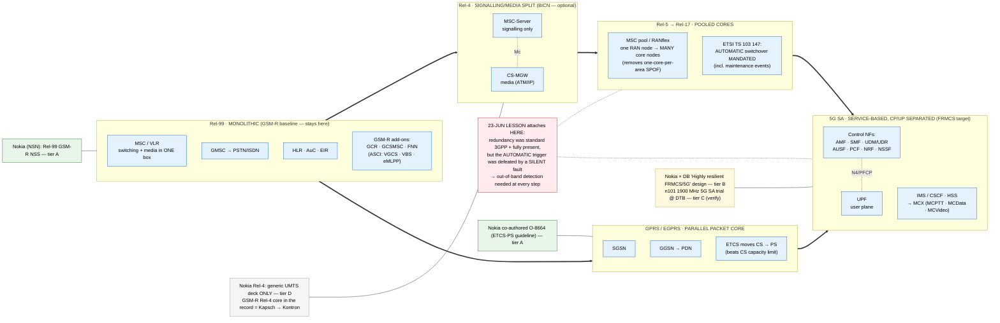

# Architecture Diagram: Physical core evolution by 3GPP release — the Nokia core-vendor lens

> **Template Origin**: Hand-authored companion visual to `../master-architecture-reference.md` (Part B) · **ArcKit Version**: 5.11.0
> Renders the rail operational-radio **core** as it splits across 3GPP releases, with Nokia's footprint mapped *by evidence tier*.

## Document Control

| Field | Value |
|---|---|
| Document ID | ARC-FRMCS-DIAG-007-v1.0 |
| Document Type | Architecture Diagram (Evolution / Building-block) |
| Project | FRMCS arcKit — GSM-R→FRMCS transition + agentic oversight |
| Classification | INTERNAL (contains C-tier estate mapping) |
| Status | DRAFT |
| Version | 1.0 |
| Created Date | 2026-07-26 |
| Last Modified | 2026-07-26 |
| Review Cycle | On core-vendor / standards-lineage evidence change |
| Next Review Date | 2026-08-26 |
| Owner | Vpnet engagement lead |
| Reviewed By | PENDING |
| Approved By | PENDING |
| Distribution | Engagement records; master architecture reference companion |

## Revision History

| Version | Date | Author | Changes | Approved By | Approval Date |
|---------|------|--------|---------|-------------|---------------|
| 1.0 | 2026-07-26 | ArcKit AI | Initial creation — companion to master-architecture-reference.md Part B | PENDING | PENDING |

---

## Purpose (layman audience)

Rail's operational-radio **core** is not bespoke kit — it rides the mainstream 3GPP core, one release behind the consumer world, and every generation splits a previously-single box into more, smaller, more separable pieces. This diagram traces that split from the monolithic GSM-R MSC to the fully service-based 5G core, and lays **Nokia's role over it by evidence tier** — showing that Nokia's core-vendor story in our record is a *bookend* (strong at the Rel-99 GSM-R core and at the 5G FRMCS design/trial; thin, generic, in the Rel-4/UMTS middle).

## Diagram

**View**: GitHub renders automatically; export via https://mermaid.live.

**Caption (for reuse):** *"One box becomes many — from the monolithic GSM-R MSC to the service-based 5G core. Nokia is strong at both ends of the record and thin (generic-only) in the middle; the GSM-R Rel-4 core here is Kapsch→Kontron, not Nokia."*

## Legend / key

| Colour | Meaning |
|---|---|
| Blue | Core network element (the physical box at that release) |
| Green | Nokia role evidenced at **tier A** (primary) |
| Amber | Nokia role at **tier B** (vendor-promotional design) |
| Grey | Nokia role at **tier D** (generic/aggregator) — not a GSM-R core claim |
| Red | The 23-June silent-fault lesson — attaches to the redundancy at every release |

| Term | Layman meaning |
|---|---|
| Monolithic MSC | One box did both call switching and the actual voice media |
| BICN / MSC-S + CS-MGW | Rel-4 splits that box into a signalling half and a media half (bearer over ATM or IP) |
| MSC pool / RANflex | A radio site talks to several core nodes, so losing one core node no longer downs the area |
| CP/UP separation | Control plane (who/where/policy) kept separate from user plane (the actual data forwarding) — starts at Rel-4, completes at 5G |
| MCX | The 5G Mission-Critical service layer that must reproduce GSM-R's ASCI/REC features |

## Key statements (and their evidence)

1. **Redundancy is standard 3GPP at every step** (1+1 → pooling → active-active); the 23-June failure was therefore a *proving-discipline* problem, not a technology gap. (E-2026-07-05-08 · E-2026-07-01-09.)
2. **Rel-4 BICN is optional for GSM-R** — TS 103 066 explicitly does not mandate it; the GSM-R baseline stays Rel-99. (E-2026-07-26-03.)
3. **CP/UP separation is a through-line, not a 5G novelty** — Rel-4 (MSC-S vs CS-MGW) → 5G SA (control NFs vs UPF); the same boundary the CCS '25 paper shows is bridgeable under weak routing enforcement. (E-2026-07-24-01.)
4. **Nokia is a bookend in the record** — tier-A at the Rel-99 GSM-R NSS and (tier-B design + tier-C trial) at 5G SA; the Rel-4/UMTS middle is Nokia's own **generic** material only (tier D). **The clean GSM-R Rel-4 core here is Kapsch→Kontron.** (E-2026-07-06-02/-03 A · E-2026-07-26-05 D · E-2026-07-26-02 A · E-2026-07-01-12 B · E-2026-07-03-02 C.)

## Honesty constraints (binding on any reuse)

- **Do not promote the D-tier generic-UMTS Rel-4 slides into a Nokia-GSM-R-Rel-4 claim.** The GSM-R Rel-4 NSS in the TEN plans is Kapsch, not Nokia.
- **DB regional RAN split (Nokia = south) is C-tier** (E-2026-06-29-02) — verify at primary before external use.
- **n101 5G SA trial is C-tier / press-reported** (E-2026-07-03-02) — verify at primary.
- The **23-June culprit layer is not shown as a core box** here — it is the ground *distribution* layer (separate diagram / equipment-map §6); never join a vendor to it.
- The 5G NF names (AMF/SMF/UPF/…) are standard 3GPP architecture terms, not a repo vendor claim.

## Requirements traceability

| Requirement | Shown as | Coverage |
|-------------|----------|----------|
| R1 (obsolescence) | The Rel-99→5G lineage motivating replacement | ✅ context |
| R3 (no central SPOF) | Monolithic MSC → pooled cores → active-active | ✅ core |
| R5 (packet-native) | GPRS/EGPRS PS branch → 5G SA | ✅ core |
| R8 / PR7 (vendor concentration) | Nokia footprint by tier; Kapsch→Kontron in the middle | ✅ core |
| PR11 (silent-fault) | The red "lesson attaches here" node | ✅ core |
| PR15 (MCX equivalence) | ASCI (Rel-99) → MCX (5G SA) | ✅ context |

**Evidence refs:** E-2026-07-01-09 (TS 103 147) · E-2026-07-01-12 (Nokia×DB FRMCS design, B) · E-2026-07-03-02 (n101 trial, C) · E-2026-07-05-08 (TS 123 236 pooling) · E-2026-07-06-02/-03 (Nokia R99 NSS, A) · E-2026-07-24-01 (5G-core CP/UP bridging) · E-2026-07-26-02 (O-8664, A) · E-2026-07-26-03 (TS 103 066 BICN, A) · E-2026-07-26-05 (Nokia UMTS deck, D) · PR11 · PR7.
