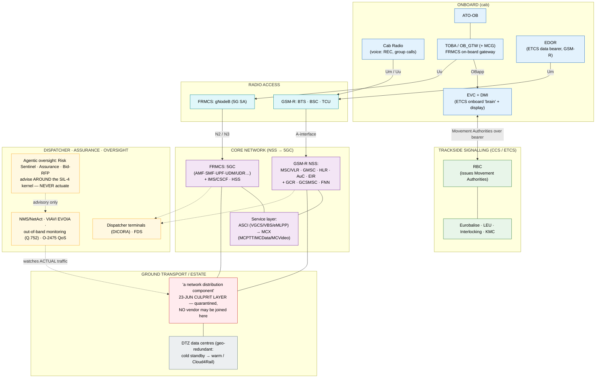

# Architecture Diagram: End-to-end physical component stack — GSM-R + FRMCS

> **Template Origin**: Hand-authored companion visual to `../master-architecture-reference.md` (Part A) · **ArcKit Version**: 5.11.0
> The full physical stack, train to ground, with the GSM-R (legacy) and FRMCS (target) elements side by side and the interfaces between strata.

## Document Control

| Field | Value |
|---|---|
| Document ID | ARC-FRMCS-DIAG-008-v1.0 |
| Document Type | Architecture Diagram (Building-block / Deployment) |
| Project | FRMCS arcKit — GSM-R→FRMCS transition + agentic oversight |
| Classification | INTERNAL (contains the quarantined culprit layer + C-tier estate mapping) |
| Status | DRAFT |
| Version | 1.0 |
| Created Date | 2026-07-26 |
| Last Modified | 2026-07-26 |
| Review Cycle | On architecture / evidence change |
| Next Review Date | 2026-08-26 |
| Owner | Vpnet engagement lead |
| Reviewed By | PENDING |
| Approved By | PENDING |
| Distribution | Engagement records; master architecture reference companion |

## Revision History

| Version | Date | Author | Changes | Approved By | Approval Date |
|---------|------|--------|---------|-------------|---------------|
| 1.0 | 2026-07-26 | ArcKit AI | Initial creation — companion to master-architecture-reference.md Part A | PENDING | PENDING |

---

## Purpose (layman audience)

One picture of the whole physical chain — from the driver's cab, over the air, through the radio access and the core network, out to the trackside signalling that actually moves trains, and down to the ground data centres — with the **legacy GSM-R** boxes and the **target FRMCS** boxes shown together, and the monitoring/oversight that watches it all. It is the map behind the component catalogue.

## Diagram

**View**: GitHub renders automatically; export via https://mermaid.live.

**Caption (for reuse):** *"The whole chain — cab to ground — with GSM-R and FRMCS side by side. The red box is the 23-June culprit layer: DB's five words only, no vendor ever attached."*

## Legend / key

| Colour | Stratum |
|---|---|
| Blue | Onboard (cab) |
| Teal | Radio access |
| Purple | Core network + service layer |
| Green | Trackside signalling (ETCS/CCS) |
| Grey | Ground estate / data centres |
| Amber | Dispatcher · assurance · oversight |
| Red | The 23-June culprit layer (quarantined) |

| Element | One-line role |
|---|---|
| TOBA / OB_GTW | On-board gateway that decouples ETCS/ATO/voice from the transport, so the radio can evolve without re-qualifying the app |
| EDOR | The GSM-R data bearer that carries Movement Authorities; 40-s silence brakes the train |
| RBC | The trackside safety computer that issues Movement Authorities over the bearer |
| ASCI → MCX | The GSM-R safety-feature set (group/emergency calls, pre-emption) that MCX must reproduce and prove equivalent |
| Out-of-band monitoring | An independent listener on the *actual* traffic — catches the fault (or compromise) a box won't self-report |

## Key statements (and their evidence)

1. **The bearer is safety-critical, not just plumbing** — EDOR/RBC over the radio carries Movement Authorities; bearer silence forces a service brake (E-2026-07-02-34).
2. **The gateway (TOBA) is the decoupling that makes migration survivable** — apps reach the on-board system only via OBapp (ADR-001, R6).
3. **The culprit layer stays quarantined** — DB's "a network distribution component" only; no vendor, no element-class inference (E-2026-06-27-01/-03).
4. **Detection must be independent** — the monitoring lane watches actual traffic (Q.752 / O-2475), because the 23-June fault raised no self-reported alarm (E-2026-06-30-03, E-2026-07-25-08).
5. **Oversight advises, never actuates** — the agentic layer sits beside the SIL-4 kernel; safety-critical actuation stays human-in-command (ADR-002/ADR-004).

## Honesty constraints (binding on any reuse)

- Culprit quarantine is absolute (as above); the two element-class inferences stay uncited.
- DB estate vendor split is **C-tier** (E-2026-06-29-02) — not shown as fact here.
- 5G NF names + several ETCS terms (KMC, LEU) are standard architecture terms, not repo vendor claims.
- This is a **reference map, not a wiring diagram** — interface labels are indicative (per-application coupling and exact reference points are ADR-001 open items).

## Requirements traceability

| Requirement | Shown as | Coverage |
|-------------|----------|----------|
| R3 (no central SPOF) | Core + ground-estate strata | ✅ context |
| R4 (fail-soft) | EDOR/RBC bearer-silence path | ✅ context |
| R5 (packet-native / ETCS/ATO/video) | FRMCS core + TOBA + MCX | ✅ core |
| R6 (gateway decoupling) | TOBA/OBapp between apps and transport | ✅ core |
| R11 (SIL-4 kernel) | Oversight advises around the kernel | ✅ context |
| R12 (awareness/monitoring) | The out-of-band monitoring lane | ✅ core |
| PR15 (MCX equivalence) | ASCI → MCX in the service layer | ✅ context |

**Evidence refs:** E-2026-06-27-01/-03 (culprit) · E-2026-06-30-03 (out-of-band monitoring) · E-2026-07-02-25/-34 (geo-redundancy; radio-loss brake) · E-2026-07-25-07 (RBC/SUBSET-078) · E-2026-07-25-08 (O-2475 QoS) · E-2026-07-25-09 (TOBA-K/GCG lab) · E-2026-07-26-01 (VIAVI monitoring, B) · ADR-001 · ADR-002 · ADR-004.
