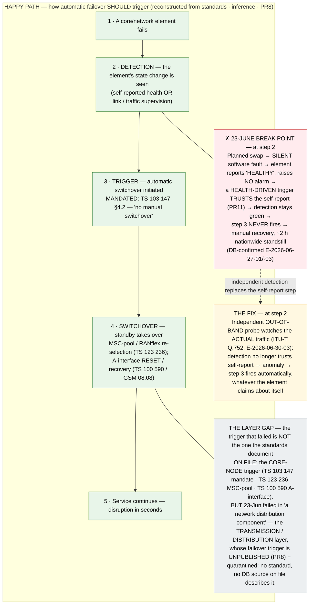

# Architecture Diagram: The happy-path failover trigger — and where it breaks

> **Template Origin**: Hand-authored · **ArcKit Version**: 5.11.0
> Reconstructs the intended automatic-failover TRIGGER flow from the standards on file, marks
> the 23-June break point, and names the layer gap the standards do not reach. Companion to
> `../finding-failover-trigger-flow-gap.md`, DIAG-001 (safe-stop) and DIAG-002 (silent-fault fix).

## Document Control

| Field | Value |
|---|---|
| Document ID | ARC-FRMCS-DIAG-009-v1.0 |
| Document Type | Architecture Diagram (Behaviour / trigger flow) |
| Project | FRMCS arcKit — GSM-R→FRMCS transition + agentic oversight |
| Classification | INTERNAL (inference-based reconstruction — PR8; culprit layer quarantined) |
| Status | DRAFT · Version 1.0 · 2026-07-26 · Owner: Vpnet engagement lead |
| Review Cycle | On R3/R4/PR11 evidence change · Next Review 2026-08-26 |
| Reviewed By | PENDING · Approved By | PENDING |

## Revision History

| Version | Date | Author | Changes | Approved | Date |
|---|---|---|---|---|---|
| 1.0 | 2026-07-26 | ArcKit AI | Initial creation — reconstructs the failover-trigger flow from TS 103 147 / TS 123 236 / TS 100 590; marks break point + distribution-layer gap | PENDING | PENDING |

---

## Purpose (layman audience)

The 23-June outage is usually described as *"the automatic failover never fired."* This diagram
makes that concrete: it traces, step by step, **how the automatic switch to the healthy backup is
supposed to be triggered**, shows the exact step where a silent fault defeats it, and — the honest
part — flags that **the layer which actually failed is not the one the standards on file describe**.
The trigger flow is a *reconstruction from the standards*, not DB's published mechanism (DB has not
released it — PR8), so it shows the *intended* flow, not a claim about DB's exact wiring.

## Diagram

**View**: GitHub renders automatically; export via https://mermaid.live.

**Caption (for reuse):** *"Failover has a trigger. On 23 June it was defeated at the detection step — because a health-driven trigger trusts a component that lied. And the layer that actually failed is the one no standard on file describes."*

## Legend / key

| Colour | Meaning |
|---|---|
| Green | The intended happy-path trigger flow (reconstructed from standards) |
| Red | The 23-June break point — step 2, detection, defeated by the silent fault |
| Amber | The fix — independent out-of-band detection replacing the self-report step |
| Grey | The layer gap — the failed trigger is at a layer the standards don't cover |

| Term | Layman meaning |
|---|---|
| Health-driven trigger | Failover decided from the component's *own* report of its health — the trust that the silent fault abused |
| MSC-pool / RANflex | The core-node redundancy: a radio site talks to several cores and re-selects on failure (TS 123 236) |
| A-interface RESET | The BSS↔core recovery procedure *after* a failure (TS 100 590 / GSM 08.08) — recovery, not the trigger |
| Out-of-band detection | A separate listener on the real traffic (Q.752) — sees the fault the component won't self-report |

## Key statements (and their evidence)

1. **A trigger exists and must be automatic** — TS 103 147 §4.2 mandates automatic switchover, no manual (E-2026-07-01-09). The flow's step 3 is a standards requirement, not an assumption.
2. **The break is at DETECTION (step 2), not redundancy** — the standby was fully functional; a health-driven trigger trusted the silent element's "healthy" self-report, so step 3 never fired (PR11; DB-confirmed E-2026-06-27-01/-03). This is why DIAG-002 frames it as a *detection* failure.
3. **The record does NOT hold DB's actual trigger flow** — this is a reconstruction from the standards; DB has not published the mechanism (PR8), so the flow is *intended*, not asserted.
4. **The standards document the WRONG layer's trigger** — TS 103 147 / TS 123 236 / TS 100 590 cover the **core-node** (MSC / A-interface) trigger; the 23-June fault was in *"a network distribution component"* — the transmission/distribution layer, whose failover trigger is **unpublished and quarantined**. The specs on file do not reach the layer that failed.
5. **The fix is layer-agnostic** — independent out-of-band detection (Q.752) triggers on actual traffic regardless of which layer or element lied, which is precisely why it answers a gap the core-node specs cannot (E-2026-06-30-03; ADR-007).

## Honesty constraints (binding on any reuse)

- **Inference, not reconstruction of DB's system (PR8).** The happy-path flow is assembled from the standards; it is the *intended* trigger flow. Say "should", not "did".
- **Culprit quarantine absolute.** The distribution-layer element carries DB's five words only — *"a network distribution component"*; no vendor, no element-class inference. The GAP box states the layer, not the element.
- **The standards are core-node scope.** Do not present TS 123 236 / TS 100 590 as describing the failed trigger — they describe the *core-node* trigger/recovery, a different layer (same guard as the master-reference and equipment-map notes).
- Dated (Rel-99) standards — used for the *mechanism class*, not clause-level claims.

## Requirements traceability

| Requirement | Shown as | Coverage |
|---|---|---|
| R3 (no central SPOF) | The failover flow that should protect against element loss | ✅ context |
| R4 (fail-soft) | Step 5 (seconds) vs the 23-June manual ~2 h | ✅ context |
| PR11 (silent-fault / health-driven trigger) | The red break point at step 2 | ✅ core |
| PR5 (SPOF-signature telemetry) | The amber fix — independent detection | ✅ core |
| PR8 (replay is inference until DB publishes) | The whole flow marked reconstruction | ✅ core |
| ADR-007 (prove the trigger fires) | The flow is exactly what ADR-007's silent-fault injection tests | ✅ core |

**Evidence refs:** E-2026-07-01-09 (TS 103 147 auto-switchover mandate) · E-2026-07-05-08 (TS 123 236 MSC-pool) · E-2026-07-26-09 (TS 100 590 A-interface RESET/recovery) · E-2026-06-27-01/-03 (silent-fault cause) · E-2026-06-30-03 (Q.752 out-of-band detection) · PR8 · PR11 · ADR-007 · DIAG-001/002.
